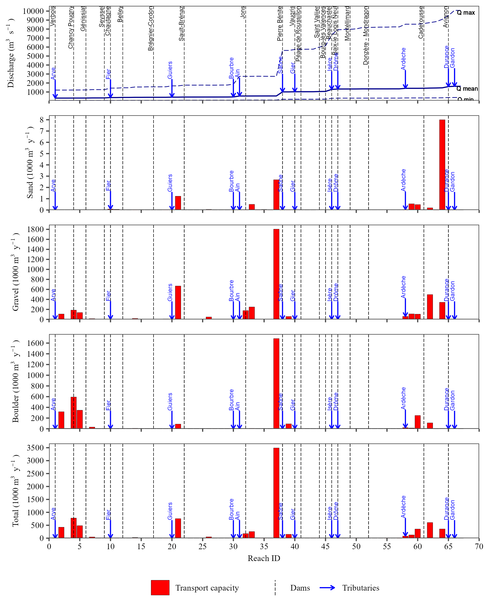
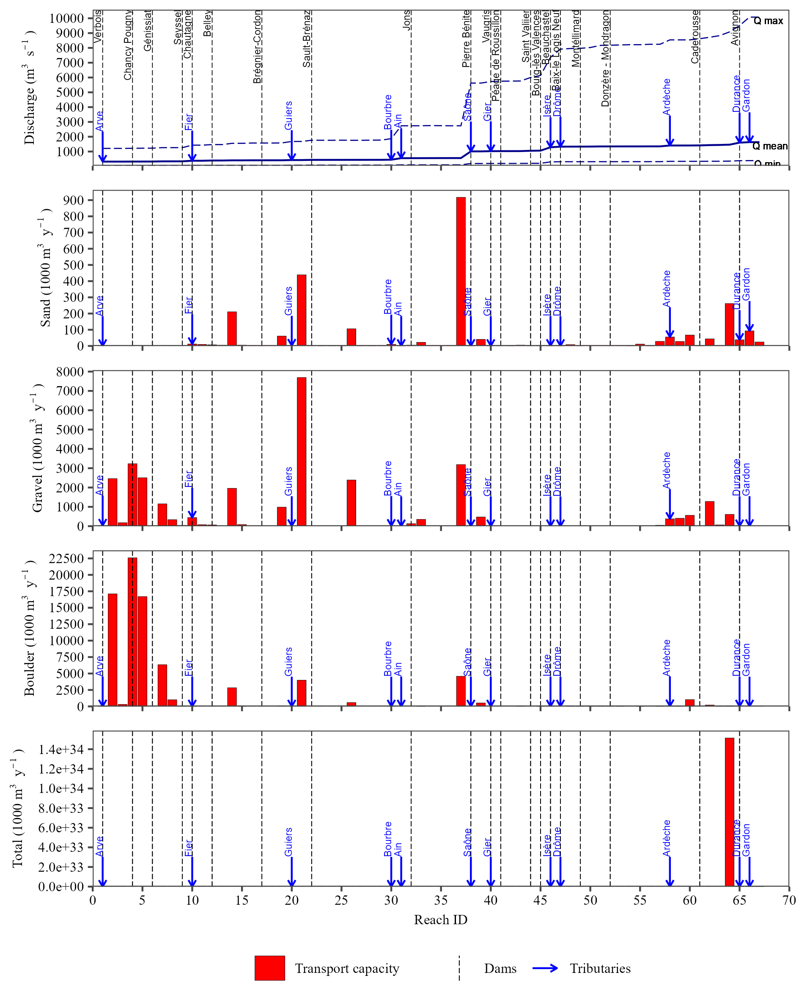
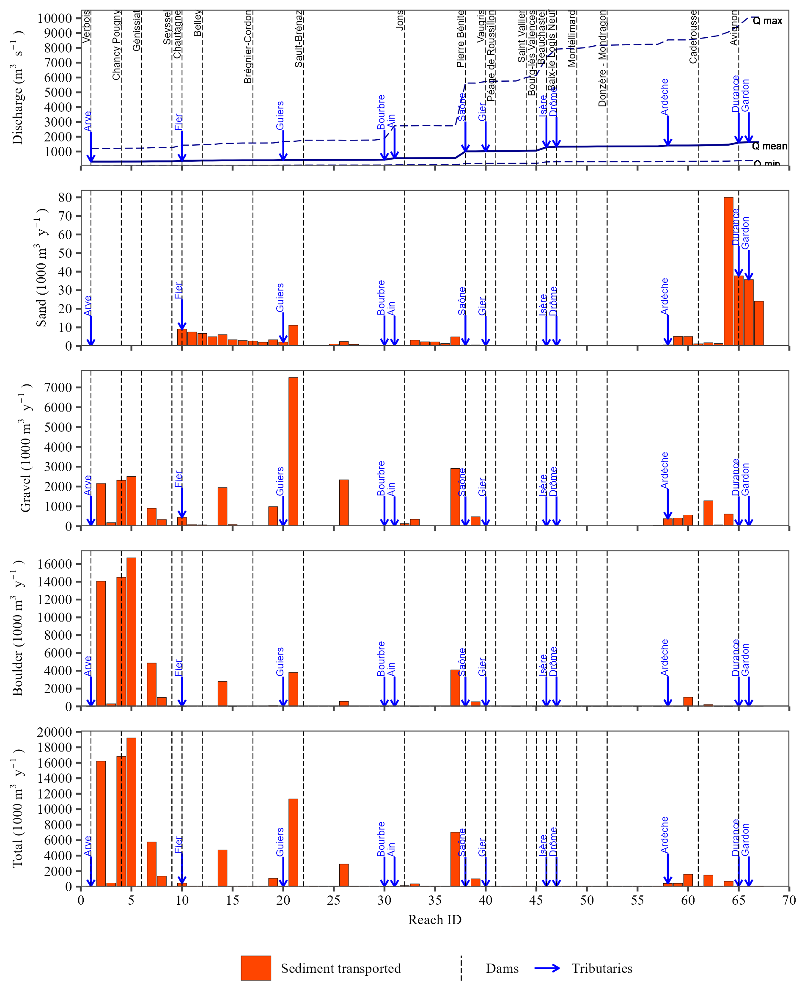
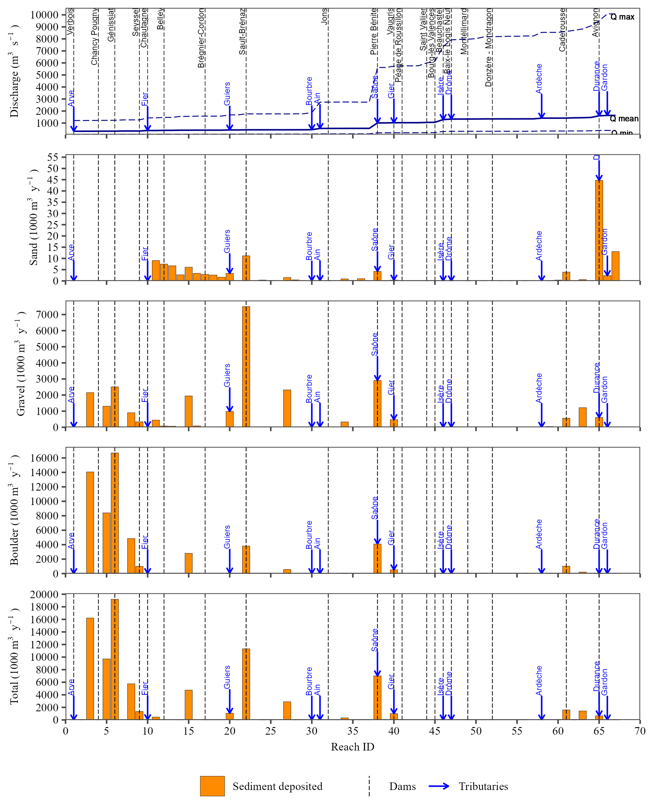
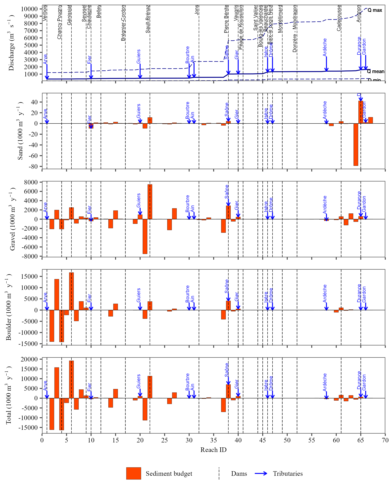
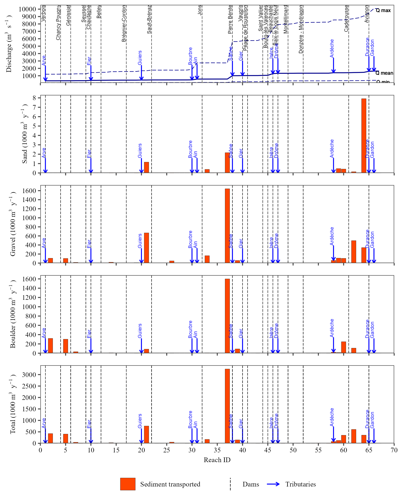
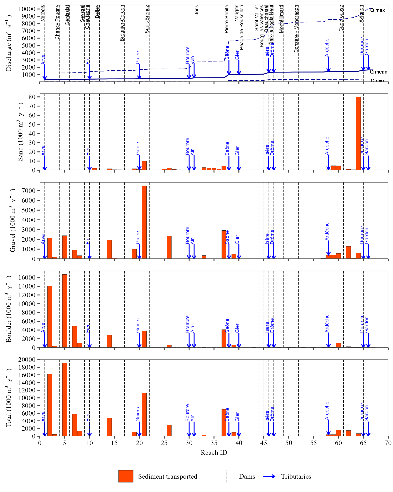
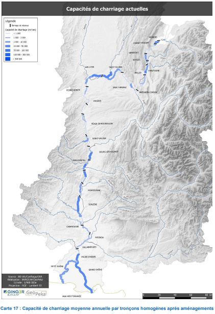

# Preliminary Result

Preliminary results were obtained using three different sediment transport equations, each simulated under three distinct trap efficiency scenarios. The equations used to estimate sediment transport were developed by Wilcock and Crowe [-@WandC2003], Eugelund and Hansen [-@EandH67], and, Ackers and White [-@AandW73].

For each equation, three trap efficiency scenarios were considered: (i) no dams influence, where the model assumes no dams present along the river; (ii) 100% trap efficiency, where all the sediment reaching a dammed reach is fully retained; and (iii) variable trap efficiencies as presented in Table 1. Simulations were caried out for the period from 2000 to 2019, with annual results available in supplementary material.

Three grain size classes were used based on Krumbein's scale: sand (0.06-2 mm), gravel (2-256 mm), and boulder (>256 mm).

The following figures (from Figure \@ref(fig:TrcE0eW) to Figure \@ref(fig:budgetE2eA)) present the cumulative bedload transported, deposited and sediment budget over the 20-year period for each equation and trap efficiency scenario.


## No dams

### Wilkock and Crowe equation


```{r TrcE0eW, echo=FALSE, fig.cap='Cumulative discharge and bedload transport capacity for sand (0.63-2 mm), gravel (2-256 mm), boulders (>256 mm), and the total of all three classes for each river reach along the Rhône River, calculated using the Wilkock and Crowe equation without accounting dams trap efficiency.'}



```


```{r TrE0eW, echo=FALSE, fig.cap='Cumulative discharge and bedload transported for sand (0.63-2 mm), gravel (2-256 mm), boulders (>256 mm), and the total of all three classes for each river reach along the Rhône River, calculated using the Wilkock and Crowe equation without accounting dams trap efficiency.'}

knitr::include_graphics("img/res_cascade/res_E0_eW&C_noDams/plots_transp-silt/transp_res_sum_hy_E0_eW&C_noDams.png")

```


```{r DepE0eW, echo=FALSE, fig.cap='Cumulative discharge and bedload deposited for sand (0.63-2 mm), gravel (2-256 mm), boulders (>256 mm), and the total of all three classes for each river reach along the Rhône River, calculated using the Wilkock and Crowe equation without accounting dams trap efficiency.'}

knitr::include_graphics("img/res_cascade/res_E0_eW&C_noDams/plots_dep-silt/dep_res_sum_hy_E0_eW&C_noDams.png")

```


```{r budgetE0eW, echo=FALSE, fig.cap='Cumulative discharge and sediment budget for sand (0.63-2 mm), gravel (2-256 mm), boulders (>256 mm), and the total of all three classes for each river reach along the Rhône River, calculated using the Wilkock and Crowe equation without accounting dams trap efficiency.'}

knitr::include_graphics("img/res_cascade/res_E0_eW&C_noDams/plots_sed_budget-silt/sed_bud_res_sum_hy_E0_eW&C_noDams.png")

```


### Eugelund and Hansen equation

```{r TrcE0eE, echo=FALSE, fig.cap='Cumulative discharge and bedload transport capacity for sand (0.63-2 mm), gravel (2-256 mm), boulders (>256 mm), and the total of all three classes for each river reach along the Rhône River, calculated using the Eugelund and Hansen equation without accounting dams trap efficiency.'}

knitr::include_graphics("img/res_cascade/res_E0_eE&H_noDams/plots_tr_cap-silt/tr_cap_res_sum_hy_E0_eE&H_noDams.png")

```


```{r TrE0eE, echo=FALSE, fig.cap='Cumulative discharge and bedload transported for sand (0.63-2 mm), gravel (2-256 mm), boulders (>256 mm), and the total of all three classes for each river reach along the Rhône River, calculated using the Eugelund and Hansen equation without accounting dams trap efficiency.'}

knitr::include_graphics("img/res_cascade/res_E0_eE&H_noDams/plots_transp-silt/transp_res_sum_hy_E0_eE&H_noDams.png")

```


```{r DepE0eE, echo=FALSE, fig.cap='Cumulative discharge and bedload deposited for sand (0.63-2 mm), gravel (2-256 mm), boulders (>256 mm), and the total of all three classes for each river reach along the Rhône River, calculated using the Eugelund and Hansen equation without accounting dams trap efficiency.'}

knitr::include_graphics("img/res_cascade/res_E0_eE&H_noDams/plots_dep-silt/dep_res_sum_hy_E0_eE&H_noDams.png")

```


```{r budgetE0eE, echo=FALSE, fig.cap='Cumulative discharge and sediment budget for sand (0.63-2 mm), gravel (2-256 mm), boulders (>256 mm), and the total of all three classes for each river reach along the Rhône River, calculated using the Eugelund and Hansen equation without accounting dams trap efficiency.'}

knitr::include_graphics("img/res_cascade/res_E0_eE&H_noDams/plots_sed_budget-silt/sed_bud_res_sum_hy_E0_eE&H_noDams.png")

```


### Ackers and White equation

```{r TrcE0eA, echo=FALSE, fig.cap='Cumulative discharge and bedload transport capacity for sand (0.63-2 mm), gravel (2-256 mm), boulders (>256 mm), and the total of all three classes for each river reach along the Rhône River, calculated using the Ackers and White equation without accounting dams trap efficiency.'}



```


```{r TrE0eA, echo=FALSE, fig.cap='Cumulative discharge and bedload transported for sand (0.63-2 mm), gravel (2-256 mm), boulders (>256 mm), and the total of all three classes for each river reach along the Rhône River, calculated using the Ackers and White equation without accounting dams trap efficiency.'}



```


```{r DepE0eA, echo=FALSE, fig.cap='Cumulative discharge and bedload deposited for sand (0.63-2 mm), gravel (2-256 mm), boulders (>256 mm), and the total of all three classes for each river reach along the Rhône River, calculated using the Ackers and White equation without accounting dams trap efficiency.'}



```


```{r budgetE0eA, echo=FALSE, fig.cap='Cumulative discharge and sediment budget for sand (0.63-2 mm), gravel (2-256 mm), boulders (>256 mm), and the total of all three classes for each river reach along the Rhône River, calculated using the Ackers and White equation without accounting dams trap efficiency.'}



```


## 100% Trap efficiency

### Wilkock and Crowe equation

```{r TrcE3eW, echo=FALSE, fig.cap='Cumulative discharge and bedload transport capacity for sand (0.63-2 mm), gravel (2-256 mm), boulders (>256 mm), and the total of all three classes for each river reach along the Rhône River, calculated using the Wilkock and Crowe equation accounting dams trap efficiency of 100%.'}

knitr::include_graphics("img/res_cascade/res_E3_eW&C/plots_tr_cap-silt/tr_cap_res_sum_hy_E3_eW&C.png")

```


```{r TrE3eW, echo=FALSE, fig.cap='Cumulative discharge and bedload transported for sand (0.63-2 mm), gravel (2-256 mm), boulders (>256 mm), and the total of all three classes for each river reach along the Rhône River, calculated using the Wilkock and Crowe equation accounting dams trap efficiency of 100%.'}



```


```{r DepE3eW, echo=FALSE, fig.cap='Cumulative discharge and bedload deposited for sand (0.63-2 mm), gravel (2-256 mm), boulders (>256 mm), and the total of all three classes for each river reach along the Rhône River, calculated using the Wilkock and Crowe equation accounting dams trap efficiency of 100%.'}

knitr::include_graphics("img/res_cascade/res_E3_eW&C/plots_dep-silt/dep_res_sum_hy_E3_eW&C.png")

```


```{r budgetE3eW, echo=FALSE, fig.cap='Cumulative discharge and sediment budget for sand (0.63-2 mm), gravel (2-256 mm), boulders (>256 mm), and the total of all three classes for each river reach along the Rhône River, calculated using the Wilkock and Crowe equation accounting dams trap efficiency of 100%.'}

knitr::include_graphics("img/res_cascade/res_E3_eW&C/plots_sed_budget-silt/sed_bud_res_sum_hy_E3_eW&C.png")

```


### Eugelund and Hansen equation

```{r TrcE3eE, echo=FALSE, fig.cap='Cumulative discharge and bedload transport capacity for sand (0.63-2 mm), gravel (2-256 mm), boulders (>256 mm), and the total of all three classes for each river reach along the Rhône River, calculated using the Eugelund and Hansen equation accounting dams trap efficiency of 100%.'}

knitr::include_graphics("img/res_cascade/res_E3_eE&H/plots_tr_cap-silt/tr_cap_res_sum_hy_E3_eE&H.png")

```


```{r TrE3eE, echo=FALSE, fig.cap='Cumulative discharge and bedload transported for sand (0.63-2 mm), gravel (2-256 mm), boulders (>256 mm), and the total of all three classes for each river reach along the Rhône River, calculated using the Eugelund and Hansen equation accounting dams trap efficiency of 100%.'}

knitr::include_graphics("img/res_cascade/res_E3_eE&H/plots_transp-silt/transp_res_sum_hy_E3_eE&H.png")

```


```{r DepE3eE, echo=FALSE, fig.cap='Cumulative discharge and bedload deposited for sand (0.63-2 mm), gravel (2-256 mm), boulders (>256 mm), and the total of all three classes for each river reach along the Rhône River, calculated using the Eugelund and Hansen equation accounting dams trap efficiency of 100%.'}

knitr::include_graphics("img/res_cascade/res_E3_eE&H/plots_dep-silt/dep_res_sum_hy_E3_eE&H.png")

```


```{r budgetE3eE, echo=FALSE, fig.cap='Cumulative discharge and sediment budget for sand (0.63-2 mm), gravel (2-256 mm), boulders (>256 mm), and the total of all three classes for each river reach along the Rhône River, calculated using the Eugelund and Hansen equation accounting dams trap efficiency of 100%.'}

knitr::include_graphics("img/res_cascade/res_E3_eE&H/plots_sed_budget-silt/sed_bud_res_sum_hy_E3_eE&H.png")

```


### Ackers and White equation

```{r TrcE3eA, echo=FALSE, fig.cap='Cumulative discharge and bedload transport capacity for sand (0.63-2 mm), gravel (2-256 mm), boulders (>256 mm), and the total of all three classes for each river reach along the Rhône River, calculated using the Ackers and White equation accounting dams trap efficiency of 100%.'}

knitr::include_graphics("img/res_cascade/res_E3_eA&W/plots_tr_cap-silt/tr_cap_res_sum_hy_E3_eA&W.png")

```


```{r TrE3eA, echo=FALSE, fig.cap='Cumulative discharge and bedload transported for sand (0.63-2 mm), gravel (2-256 mm), boulders (>256 mm), and the total of all three classes for each river reach along the Rhône River, calculated using the Ackers and White equation accounting dams trap efficiency of 100%.'}



```


```{r DepE3eA, echo=FALSE, fig.cap='Cumulative discharge and bedload deposited for sand (0.63-2 mm), gravel (2-256 mm), boulders (>256 mm), and the total of all three classes for each river reach along the Rhône River, calculated using the Ackers and White equation accounting dams trap efficiency of 100%.'}

knitr::include_graphics("img/res_cascade/res_E3_eA&W/plots_dep-silt/dep_res_sum_hy_E3_eA&W.png")

```


```{r budgetE3eA, echo=FALSE, fig.cap='Cumulative discharge and sediment budget for sand (0.63-2 mm), gravel (2-256 mm), boulders (>256 mm), and the total of all three classes for each river reach along the Rhône River, calculated using the Ackers and White equation accounting dams trap efficiency of 100%.'}

knitr::include_graphics("img/res_cascade/res_E3_eA&W/plots_sed_budget-silt/sed_bud_res_sum_hy_E3_eA&W.png")

```


## Trap efficiency (Table 1)

### Wilkock and Crowe equation

```{r TrcE2eW, echo=FALSE, fig.cap='Cumulative discharge and bedload transport capacity for sand (0.63-2 mm), gravel (2-256 mm), boulders (>256 mm), and the total of all three classes for each river reach along the Rhône River, calculated using the Wilkock and Crowe equation accounting dams trap efficiency of Table 1.'}

knitr::include_graphics("img/res_cascade/res_E2_eW&C/plots_tr_cap-silt/tr_cap_res_sum_hy_E2_eW&C.png")

```


```{r TrE2eW, echo=FALSE, fig.cap='Cumulative discharge and bedload transported for sand (0.63-2 mm), gravel (2-256 mm), boulders (>256 mm), and the total of all three classes for each river reach along the Rhône River, calculated using the Wilkock and Crowe equation accounting dams trap efficiency of Table 1.'}

knitr::include_graphics("img/res_cascade/res_E2_eW&C/plots_transp-silt/transp_res_sum_hy_E2_eW&C.png")

```


```{r DepE2eW, echo=FALSE, fig.cap='Cumulative discharge and bedload deposited for sand (0.63-2 mm), gravel (2-256 mm), boulders (>256 mm), and the total of all three classes for each river reach along the Rhône River, calculated using the Wilkock and Crowe equation accounting dams trap efficiency of Table 1.'}

knitr::include_graphics("img/res_cascade/res_E2_eW&C/plots_dep-silt/dep_res_sum_hy_E2_eW&C.png")

```


```{r budgetE2eW, echo=FALSE, fig.cap='Cumulative discharge and sediment budget for sand (0.63-2 mm), gravel (2-256 mm), boulders (>256 mm), and the total of all three classes for each river reach along the Rhône River, calculated using the Wilkock and Crowe equation accounting dams trap efficiency of Table 1.'}

knitr::include_graphics("img/res_cascade/res_E2_eW&C/plots_sed_budget-silt/sed_bud_res_sum_hy_E2_eW&C.png")

```


### Eugelund and Hansen equation

```{r TrcE2eE, echo=FALSE, fig.cap='Cumulative discharge and bedload transport capacity for sand (0.63-2 mm), gravel (2-256 mm), boulders (>256 mm), and the total of all three classes for each river reach along the Rhône River, calculated using the Eugelund and Hansen equation accounting dams trap efficiency of Table 1.'}

knitr::include_graphics("img/res_cascade/res_E2_eE&H/plots_tr_cap-silt/tr_cap_res_sum_hy_E2_eE&H.png")

```


```{r TrE2eE, echo=FALSE, fig.cap='Cumulative discharge and bedload transported for sand (0.63-2 mm), gravel (2-256 mm), boulders (>256 mm), and the total of all three classes for each river reach along the Rhône River, calculated using the Eugelund and Hansen equation accounting dams trap efficiency of Table 1.'}

knitr::include_graphics("img/res_cascade/res_E2_eE&H/plots_transp-silt/transp_res_sum_hy_E2_eE&H.png")

```


```{r DepE2eE, echo=FALSE, fig.cap='Cumulative discharge and bedload deposited for sand (0.63-2 mm), gravel (2-256 mm), boulders (>256 mm), and the total of all three classes for each river reach along the Rhône River, calculated using the Eugelund and Hansen equation accounting dams trap efficiency of Table 1.'}

knitr::include_graphics("img/res_cascade/res_E2_eE&H/plots_dep-silt/dep_res_sum_hy_E2_eE&H.png")

```


```{r budgetE2eE, echo=FALSE, fig.cap='Cumulative discharge and sediment budget for sand (0.63-2 mm), gravel (2-256 mm), boulders (>256 mm), and the total of all three classes for each river reach along the Rhône River, calculated using the Eugelund and Hansen equation accounting dams trap efficiency of Table 1.'}

knitr::include_graphics("img/res_cascade/res_E2_eE&H/plots_sed_budget-silt/sed_bud_res_sum_hy_E2_eE&H.png")

```


### Ackers and White equation

```{r TrcE2eA, echo=FALSE, fig.cap='Cumulative discharge and bedload transport capacity for sand (0.63-2 mm), gravel (2-256 mm), boulders (>256 mm), and the total of all three classes for each river reach along the Rhône River, calculated using the Ackers and White equation without accounting dams trap efficiency.'}

knitr::include_graphics("img/res_cascade/res_E2_eA&W/plots_tr_cap-silt/tr_cap_res_sum_hy_E2_eA&W.png")

```


```{r TrE2eA, echo=FALSE, fig.cap='Cumulative discharge and bedload transported for sand (0.63-2 mm), gravel (2-256 mm), boulders (>256 mm), and the total of all three classes for each river reach along the Rhône River, calculated using the Ackers and White equation without accounting dams trap efficiency.'}

knitr::include_graphics("img/res_cascade/res_E2_eA&W/plots_transp-silt/transp_res_sum_hy_E2_eA&W.png")

```


```{r DepE2eA, echo=FALSE, fig.cap='Cumulative discharge and bedload deposited for sand (0.63-2 mm), gravel (2-256 mm), boulders (>256 mm), and the total of all three classes for each river reach along the Rhône River, calculated using the Ackers and White equation without accounting dams trap efficiency.'}

knitr::include_graphics("img/res_cascade/res_E2_eA&W/plots_dep-silt/dep_res_sum_hy_E2_eA&W.png")

```


```{r budgetE2eA, echo=FALSE, fig.cap='Cumulative discharge and sediment budget for sand (0.63-2 mm), gravel (2-256 mm), boulders (>256 mm), and the total of all three classes for each river reach along the Rhône River, calculated using the Ackers and White equation without accounting dams trap efficiency.'}

knitr::include_graphics("img/res_cascade/res_E2_eA&W/plots_sed_budget-silt/sed_bud_res_sum_hy_E2_eA&W.png")

```


## Bedload transport capacity

The results of transport capacity using the three equations along the Rhône River are shown in Figure \@ref(fig:Trcmap). The scale was adjusted to be consistent with the report by Laval [-@Laval20] (Figure \@ref(fig:Laval20)).


```{r Trcmap, echo=FALSE, fig.cap='Bedload transport capacity along the Rhône River calculated using three different equations: Wilcock and Crowe, Engelund and Hansen, and Ackers and White.'}

knitr::include_graphics("img/res_cascade_trc.png")

```

```{r Laval20, echo=FALSE, fig.cap='Bedload transport capacity actual according Laval [-@Laval20].', out.width="60%"}



```

Analyzing the bedload transport capacity described in the report by Laval [-@Laval20], the equation that produced the most consistent pattern in the CASCADE model was that of Engelund and Hansen [-@EandH67]. The Ackers and White equation [-@AandW73] also showed a reasonable pattern; however, when comparing the results (Figure \@ref(fig:TrcE2eA)), the transport capacity simulated by the CASCADE model was significantly higher.

Similarly, although the Engelund and Hansen equation [-@EandH67] tended to overestimate transport capacity, its results were more consistent with the reference than those from the other equations.

Figure \@ref(fig:EHxLaval20) shows a comparison between the results from Laval [-@Laval20] and those obtained using the Engelund and Hansen [-@EandH67] equation, presented in quantiles.


```{r EHxLaval20, echo=FALSE, fig.cap='Bedload transport capacity actual according Laval [-@Laval20] and Engelund and Hansen [-@EandH67].'}

knitr::include_graphics("img/res_cascade_trcxlaval.png")

```


