```{r setup, include=FALSE}
knitr::opts_chunk$set(echo = TRUE)
```


```{r, include=FALSE}
# Libraries
library(sf)
library(mapview)
library(plotly)
library(ggrepel)
library(dplyr)
library(tidyverse)
library(ggpubr)
library(forestmangr)
library(zoo)
library(egg)
library(shiny)
library(rmarkdown)


```


# Methods

## Study area

Located in the South-West of Switzerland and South-East of France the Rhône River flows trough 800 km, where ~525 km in French territory. The Rhône River catchment is the most important source of hydropower in France. It covers an area of approximately 97800 km2, of which 87400 km2 (about 90%) lies within French territory (Figure \@ref(fig:local)). In this study, we simulated the bedload connectivity along the main Rhône River within French territory.

```{r local, echo=FALSE, fig.cap='Location of the Rhône River catchment with the main dams along the river.'}
knitr::include_graphics("img/local_mapa.png")

```

Grain size distribution (GSD) data and bedload measurements in rivers are often scarce or absent, making bedload modeling challenging. For this reason, we chose to model the bedload connectivity along the Rhône River rather than in its tributaries, where data availability even more limited.


## Cascade Model Data Input

The Cascade model is an expert-based model that uses geomorphological river characteristics to simulate bedload transport capacity.

To characterize the geomorfological properties of the river, the dataset must include information for each river reach.

### Number of Reaches

To prepare the input data for the Cascade model, the river reaches were modified to incorporate the reservoirs associated with each dam. The previous dataset contained 195 reaches, after the adjustments, we updated dataset includes a total of 67 reaches.

We adapted the number of reaches by summarizing those with similar geomorphological characteristics by integrating all reaches contained within each dam reservoir. Figure \@ref(fig:reaches) shows the integration of the reaches within the Génissiat Reservoir.


```{r reaches, echo=FALSE, fig.cap='Integration of reaches affected by dam reservoirs'}
knitr::include_graphics("img/reach.png")

```


### Elevation and Slope data smoothed

To remove the effect of dams on elevation and slope along the Rhône River, we smoothed the elevation profile to approximate as closely as possible the natural river slope, without influence of dam reservoirs. The resulting smoothed elevation profile is show in Figure \@ref(fig:elev). Figure \@ref(fig:slope) shows the slope for each river reach based on the smoothed elevation profile. The slope in the upper part of the Rhône River is steeper, while downstream of the Génissiat Dam, the slope becomes more gradual and remains relatively uniform until the catchment outlet.


```{r elev, fig.cap= 'Comparision between the original and smoothed elevation profile of the Rhône River.', fig.height=4, fig.width=7, fig.dpi=500, echo=FALSE, warning=FALSE}

# New data with less reaches

df_elev <- read.csv("data_rhone/Tables/elev_smooth_r67.csv")
df_elev$pk <- cumsum(df_elev$Length)/1000

read_shp <- read_sf('data_rhone/GIS_data/network/Rhone_67reaches.shp')
shp <- read_shp %>%
  rename(Dam = la_prise0) %>%
  arrange(reach_ID)

shp$pk <- cumsum(shp$Length)/1000
dams <- shp[!is.na(shp$Dam),]
trib <- shp[!is.na(shp$Trib),]

plt_elev <- ggplot(shp) +
  geom_line(aes(pk,el_FN, colour = 'red')) +
  geom_line(data = df_elev, aes(pk,el_FN, colour = 'green4')) +
  geom_vline(data = dams, aes(xintercept = pk, colour = 'black'), linetype = 5, lwd = 0.2) +
  geom_text(aes(pk, el_FN, label = Dam), angle = 90, vjust = -0.2, hjust = 1, size = 2, y = Inf) +
  geom_segment(data = trib, aes(x = pk, xend = pk, y = el_FN+(max(el_FN)*0.2), yend = el_FN, colour = 'blue'), arrow = arrow(length = unit(0.15, 'cm')), linewidth = 0.5) +
  geom_text(data = trib, aes(pk, el_FN+(max(el_FN)*0.2), label = Trib), angle = 90, vjust = 0, hjust = 0, size = 2, color = 'blue') +
  scale_y_continuous(name = expression('Elevation (m)'), n.breaks = 10, expand = expansion(c(0,0.05)), limits = c(0,600)) +
  scale_x_continuous(n.breaks = 10) +
  scale_colour_manual(breaks = c('red', 'green4', 'black', 'blue'),
                      values = c('red', 'green4', 'black', 'blue'),
                      labels = c('Elevation (DEM)', 'Elevation (Smoothed)', 'Dams', 'Tributaries'), name = '') +
  labs(x = 'Reach ID') +
  theme_article(base_family = "Times New Roman") +
  theme(legend.key.height = unit(0.5, 'cm'), legend.position = 'bottom', legend.spacing = unit(0, 'cm')) +
  theme(text = element_text(size = 8, colour = 'black'),
        axis.text = element_text(size = 8, colour = 'black'))
plt_elev

# ggsave(filename = 'img/elev_profile.svg', plot = plt_elev, width = 16, height = 8, units = 'cm', dpi = 300)


```


```{r slope, fig.cap= 'Longitudinal slope profile of the Rhône River derived from the smoothed elevation data.', fig.height=4, fig.width=7, fig.dpi=500, echo=FALSE, warning=FALSE}


# New data with less reaches

shp_var <- read_shp %>%
  rename(Dam = la_prise0) %>%
  arrange(reach_ID) 

df_ele_smooth <- df_elev %>%
  select(reach_ID,el_FN,el_TN,Slope)

shp_smooted <- shp_var %>%
  select(reach_ID,Length,FromN,ToN,Dam,Trib,n,Wac) %>%
  left_join(df_ele_smooth, by = "reach_ID")


shp_smooted$pk <- cumsum(shp_smooted$Length)/1000
dams <- shp_smooted[!is.na(shp_smooted$Dam),]
trib <- shp_smooted[!is.na(shp_smooted$Trib),]

plt_slope <- ggplot(shp_smooted) +
  geom_line(aes(pk, Slope, colour = "orange")) +
  geom_vline(data = dams, aes(xintercept = pk, colour = 'black'), linetype = 5, lwd = 0.2) +
  geom_text(aes(pk, el_FN, label = Dam), angle = 90, vjust = -0.2, hjust = 1, size = 2, y = Inf) +
  geom_segment(data = trib, aes(x = pk, xend = pk, y = Slope+(max(shp_smooted$Slope)*0.2), yend = Slope, colour = 'blue'), arrow = arrow(length = unit(0.15, 'cm')), linewidth = 0.5) +
  geom_text(data = trib, aes(pk, Slope+(max(shp_smooted$Slope)*0.2), label = Trib), angle = 90, vjust = 0, hjust = 0, size = 2, color = 'blue') +
  scale_y_continuous(name = expression('Elevation (m)'), n.breaks = 10, expand = expansion(c(0,0.05)), limits = c(0,0.015)) +
  scale_x_continuous(n.breaks = 10) +
  scale_colour_manual(breaks = c("orange", 'black', 'blue'),
                      values = c("orange", 'black', 'blue'),
                      labels = c("Slope (m/m)", 'Dams', 'Tributaries'), name = '') +
  labs(x = 'Reach ID') +
  theme_article(base_family = "Times New Roman") +
  theme(legend.key.height = unit(0.5, 'cm'), legend.position = 'bottom', legend.spacing = unit(0, 'cm')) +
  theme(text = element_text(size = 8, colour = 'black'),
        axis.text = element_text(size = 8, colour = 'black')) 
plt_slope

# ggsave(filename = 'img/slope_profile.svg', plot = plt_slope, width = 16, height = 8, units = 'cm', dpi = 300)

```


### Channel width and Manning's coefficient


Figure \@ref(fig:wac) shows the channel width, and Figure \@ref(fig:n) shows the Manning’s coefficient for each river reach along the Rhône River. Figure \@ref(fig:basemaps) shows the longitudinal variation of Manning’s coefficient, channel width, and slope along the river. Channel width tends to increase at confluences with tributaries. The Manning’s coefficient was defined as relative uniform along the Rhône River.

```{r wac, fig.cap= 'Channel width of each river reach along the Rhône River.', fig.height=4, fig.width=7, fig.dpi=500, echo=FALSE, warning=FALSE}

p_wac <- ggplot(shp_smooted) +
  geom_col(aes(reach_ID, Wac, fill = 'green4'), color = 1, lwd = 0.1) +
  geom_line(aes(reach_ID, el_FN, colour = 'coral4'), lwd = 0.5) +
  geom_point(data = dams, aes(reach_ID, el_FN, colour = 'black'), shape = 18, size = 2) +
  scale_y_continuous(name = expression('Width channel (m)'), n.breaks = 10, expand = c(0,0), limits = c(0,500),
                     sec.axis = sec_axis(~., name = 'Altitude (m)', breaks = seq(0,500,100))) +
  scale_x_continuous(n.breaks = 10) +
  geom_text(aes(reach_ID, el_FN, label = Dam), angle = 90, vjust = -0.2, hjust = 1, size = 2, y = Inf) +
  geom_segment(data = trib, aes(x = reach_ID, xend = reach_ID, y = el_FN+50, yend = el_FN, colour = 'blue'),
               arrow = arrow(length = unit(0.15, 'cm')), linewidth = 0.5) +
  geom_text(data = trib, aes(reach_ID, el_FN+50, label = Trib), angle = 90, vjust = -0.2, hjust = 0, size = 2, color = 'blue') +
  geom_vline(data = dams, aes(xintercept = reach_ID, colour = 'black'), linetype = 5, lwd = 0.2) +
  scale_fill_manual(breaks = c('gray75', 'chocolate1', 'brown', 'green4', 'coral4', 'black', 'blue'),
                    values = c('gray75', 'chocolate1', 'brown', 'green4', 'coral4', 'black', 'blue'),
                    labels = c('Manning`s coefficient', 'Slope', 'GSD', 'Width channel', 'Altitude', 'Dams', 'Tributaries'), name = '') +
  scale_colour_manual(breaks = c('gray75', 'chocolate1', 'brown', 'green4', 'coral4', 'black', 'blue'),
                      values = c('gray75', 'chocolate1', 'brown', 'green4', 'coral4', 'black', 'blue'),
                      labels = c('Manning`s coefficient', 'Slope', 'GSD', 'Width channel', 'Altitude', 'Dams', 'Tributaries'), name = '') +
  labs(x = 'Reach ID') +
  theme_article(base_family = "Times New Roman") +
  geom_hline(yintercept = 0, lwd = 0.2) +
  theme(legend.key.height = unit(0.5, 'cm'), legend.position = 'bottom', legend.spacing = unit(0, 'cm')) +
  theme(text = element_text(size = 8, colour = 'black'),
        axis.text = element_text(size = 8, colour = 'black')) 
p_wac

# ggsave(filename = 'img/width_channel.svg', plot = p_wac, width = 16, height = 8, units = 'cm', dpi = 300)

```


```{r n, fig.cap= 'Manning’s coefficient of each river reach along the Rhône River.', fig.height=4, fig.width=7, fig.dpi=500, echo=FALSE, warning=FALSE}

# Manning's coefficient

p_n <- ggplot(shp_smooted) +
  geom_col(aes(reach_ID, n, fill = 'gray75'), color = 1, lwd = 0.1) +
  geom_line(aes(reach_ID, el_FN/5000, colour = 'coral4'), lwd = 0.5) +
  geom_point(data = dams, aes(reach_ID, el_FN/5000, colour = 'black'), shape = 18, size = 2) +
  scale_y_continuous(name = expression('Manning`s coefficient (m'^{1/3}~'.s'^-1~')'), n.breaks = 10, expand = c(0,0), limits = c(0,0.1),
                     sec.axis = sec_axis(~.*5000, name = 'Altitude (m)', breaks = seq(0,500,100))) +
  scale_x_continuous(n.breaks = 10) +
  geom_text(aes(reach_ID, el_FN/5000, label = Dam), angle = 90, vjust = -0.2, hjust = 1, size = 2, y = Inf) +
  geom_segment(data = trib, aes(x = reach_ID, xend = reach_ID, y = el_FN/5000+0.01, yend = el_FN/5000, colour = 'blue'),
               arrow = arrow(length = unit(0.15, 'cm')), linewidth = 0.5) +
  geom_text(data = trib, aes(reach_ID, el_FN/5000+0.01, label = Trib), angle = 90, vjust = -0.2, hjust = 0, size = 2, color = 'blue') +
  geom_vline(data = dams, aes(xintercept = reach_ID, colour = 'black'), linetype = 5, lwd = 0.2) +
  scale_fill_manual(breaks = c('gray75', 'chocolate1', 'brown', 'coral4', 'black', 'blue'),
                    values = c('gray75', 'chocolate1', 'brown', 'coral4', 'black', 'blue'),
                    labels = c('Manning`s coefficient', 'Slope', 'GSD', 'Altitude', 'Dams', 'Tributaries'), name = '') +
  scale_colour_manual(breaks = c('gray75', 'chocolate1', 'brown', 'coral4', 'black', 'blue'),
                      values = c('gray75', 'chocolate1', 'brown', 'coral4', 'black', 'blue'),
                      labels = c('Manning`s coefficient', 'Slope', 'GSD', 'Altitude', 'Dams', 'Tributaries'), name = '') +
  labs(x = 'Reach ID') +
  theme_article(base_family = "Times New Roman") +
  geom_hline(yintercept = 0, lwd = 0.2) +
  theme(legend.key.height = unit(0.5, 'cm'), legend.position = 'bottom', legend.spacing = unit(0, 'cm')) +
  theme(text = element_text(size = 8, colour = 'black'),
        axis.text = element_text(size = 8, colour = 'black'))
p_n

# ggsave(filename = 'img/manning.svg',, plot = p_n, width = 16, height = 8, units = 'cm', dpi = 300)

```


```{r basemaps, echo=FALSE, fig.cap='Longitudinal Manning’s coefficient, slope, and channel width along the Rhône River.'}
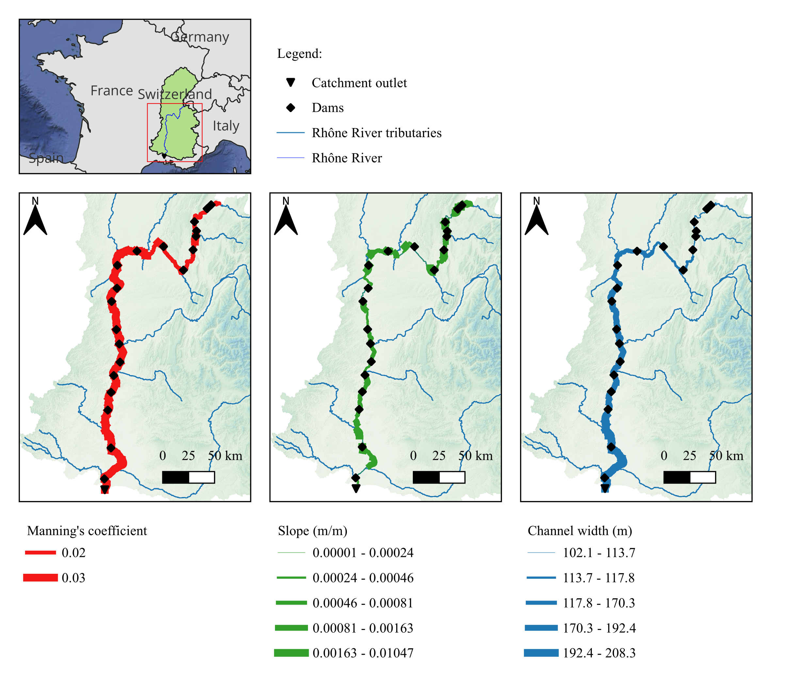

```


### GSD along the Rhône River


```{r, include=FALSE}

# GSD points

## GSD data Parrot et al (2021)
df_gsd_parrot <- read.csv("data_rhone/GIS_data/gsd/gsd_parrot.csv")
df_gsd_parrot <- df_gsd_parrot[,c("reach_ID", "D16mm", "D50mm", "D84mm")]

df_gsd <- aggregate(.~reach_ID, data = df_gsd_parrot, FUN = max) %>%
  rename(D16 = D16mm, D50 = D50mm, D84 = D84mm) %>% na.omit()
df_gsd[,-1] <- df_gsd[,-1]/1000


reach_ID <- c(1:67)
df_gsd_67 <- data.frame(reach_ID = reach_ID)
df_gsd67 <- df_gsd_67 %>% left_join(df_gsd, by = "reach_ID")

shp_gsd_noapprox <- shp_smooted %>% left_join(df_gsd67, by = "reach_ID")

shp_gsd_approx <- shp_gsd_noapprox
shp_gsd_approx$D16 <- na.approx(shp_gsd_approx$D16, na.rm = F)
shp_gsd_approx$D16 <- na.locf(shp_gsd_approx$D16, fromLast = T)

shp_gsd_approx$D50 <- na.approx(shp_gsd_approx$D50, na.rm = F)
shp_gsd_approx$D50 <- na.locf(shp_gsd_approx$D50, fromLast = T)

shp_gsd_approx$D84 <- na.approx(shp_gsd_approx$D84, na.rm = F)
shp_gsd_approx$D84 <- na.locf(shp_gsd_approx$D84, fromLast = T)


dams <- shp_gsd_approx[!is.na(shp$Dam),]
trib <- shp_gsd_approx[!is.na(shp$Trib),]

# write_sf(shp_gsd_approx, "data_rhone/GIS_data/network/Rhone_reaches_Cascade21.shp")

```


```{r, include=FALSE}

# piloting the GSD graphics

# Elevation

plt_elev_gsd <- ggplot(shp_gsd_approx) +
  geom_line(aes(reach_ID, el_FN, colour = 'coral4'), lwd = 0.5) +
  geom_point(data = dams, aes(reach_ID, el_FN, colour = 'black'), shape = 18, size = 2) +
  scale_y_continuous(name = 'Elevation (m)', limits = c(0,600), n.breaks = 5, expand = expansion(mult = c(0,0.2))) +
  scale_x_continuous(n.breaks = 10) +
  geom_text(aes(reach_ID, el_FN, label = Dam), angle = 90, vjust = -0.2, hjust = 1, size = 2, y = Inf) +
  geom_segment(data = trib, aes(x = reach_ID, xend = reach_ID, y = el_FN+(max(shp_gsd_approx$el_FN)*0.2), yend = el_FN, colour = 'blue'),
               arrow = arrow(length = unit(0.15, 'cm')), linewidth = 0.5) +
  geom_text(data = trib, aes(reach_ID, el_FN+(max(shp_gsd_approx$el_FN)*0.2), label = Trib), angle = 90, vjust = -0.2, hjust = 0, size = 2, color = 'blue') +
  geom_vline(data = dams, aes(xintercept = reach_ID, colour = 'black'), linetype = 5, lwd = 0.2) +
  scale_fill_manual(breaks = c('brown1', 'gray10', 'coral4', 'black', 'blue'),
                    values = c('brown1', 'gray10', 'coral4', 'black', 'blue'),
                    labels = c('GSD estimated', 'GSD measured', 'Elevation', 'Dams', 'Tributaries'), name = '') +
  scale_colour_manual(breaks = c('brown1', 'gray10', 'coral4', 'black', 'blue'),
                      values = c('brown1', 'gray10', 'coral4', 'black', 'blue'),
                      labels = c('GSD estimated', 'GSD measured', 'Elevation', 'Dams', 'Tributaries'), name = '') +
  labs(x = 'Reach ID') +
  theme_article(base_family = "Times New Roman") +
  geom_hline(yintercept = 0, lwd = 0.2) +
  theme(legend.key.height = unit(0.5, 'cm'), legend.position = 'none', legend.spacing = unit(0, 'cm')) +
  theme(text = element_text(size = 8, colour = 'black'),
        axis.text = element_text(size = 8, colour = 'black'),
        axis.text.x = element_blank(), axis.title.x = element_blank()) 
plt_elev_gsd


# D16

p_D16 <- ggplot(shp_gsd_approx) +
  geom_col(aes(reach_ID, D16, fill = 'brown1'), color = 1, lwd = 0.1) +
  geom_col(data = df_gsd, aes(reach_ID, D16, fill = 'gray10'), color = 1, lwd = 0.1) +
  scale_y_continuous(name = expression('D16 (m)'), n.breaks = 5, expand = expansion(mult = c(0,0.2))) +
  scale_x_continuous(n.breaks = 10) +
  geom_segment(data = trib, aes(x = reach_ID, xend = reach_ID, y = D16+(max(df_gsd$D16)*0.2),
                                yend = D16, colour = 'blue'), arrow = arrow(length = unit(0.15, 'cm')), linewidth = 0.5) +
  geom_text(data = trib, aes(reach_ID, D16+(max(df_gsd$D16)*0.2),
                             label = Trib), angle = 90, vjust = -0.2, hjust = 0, size = 2, color = 'blue') +
  geom_vline(data = dams, aes(xintercept = reach_ID, colour = 'black'), linetype = 5, lwd = 0.2) +
  scale_fill_manual(breaks = c('brown1', 'gray10', 'coral4', 'black', 'blue'),
                    values = c('brown1', 'gray10', 'coral4', 'black', 'blue'),
                    labels = c('GSD estimated', 'GSD measured', 'Elevation', 'Dams', 'Tributaries'), name = '') +
  scale_colour_manual(breaks = c('brown1', 'gray10', 'coral4', 'black', 'blue'),
                      values = c('brown1', 'gray10', 'coral4', 'black', 'blue'),
                      labels = c('GSD estimated', 'GSD measured', 'Elevation', 'Dams', 'Tributaries'), name = '') +
  labs(x = 'Reach ID') +
  theme_article(base_family = "Times New Roman") +
  geom_hline(yintercept = 0, lwd = 0.2) +
  theme(legend.key.height = unit(0.5, 'cm'), legend.position = 'none', legend.spacing = unit(0, 'cm')) +
  theme(text = element_text(size = 8, colour = 'black'),
        axis.text = element_text(size = 8, colour = 'black'),
        axis.text.x = element_blank(), axis.title.x = element_blank()) 
p_D16


# D50

p_D50 <- ggplot(shp_gsd_approx) +
  geom_col(aes(reach_ID, D50, fill = 'brown1'), color = 1, lwd = 0.1) +
  geom_col(data = df_gsd, aes(reach_ID, D50, fill = 'gray10'), color = 1, lwd = 0.1) +
  scale_y_continuous(name = expression('D50 (m)'), n.breaks = 5, expand = expansion(mult = c(0,0.2))) +
  scale_x_continuous(n.breaks = 10) +
  geom_segment(data = trib, aes(x = reach_ID, xend = reach_ID, y = D50+(max(df_gsd$D50)*0.2),
                                yend = D50, colour = 'blue'), arrow = arrow(length = unit(0.15, 'cm')), linewidth = 0.5) +
  geom_text(data = trib, aes(reach_ID, D50+(max(df_gsd$D50)*0.2),
                             label = Trib), angle = 90, vjust = -0.2, hjust = 0, size = 2, color = 'blue') +
  geom_vline(data = dams, aes(xintercept = reach_ID, colour = 'black'), linetype = 5, lwd = 0.2) +
  scale_fill_manual(breaks = c('brown1', 'gray10', 'coral4', 'black', 'blue'),
                    values = c('brown1', 'gray10', 'coral4', 'black', 'blue'),
                    labels = c('GSD estimated', 'GSD measured', 'Elevation', 'Dams', 'Tributaries'), name = '') +
  scale_colour_manual(breaks = c('brown1', 'gray10', 'coral4', 'black', 'blue'),
                      values = c('brown1', 'gray10', 'coral4', 'black', 'blue'),
                      labels = c('GSD estimated', 'GSD measured', 'Elevation', 'Dams', 'Tributaries'), name = '') +
  labs(x = 'Reach ID') +
  theme_article(base_family = "Times New Roman") +
  geom_hline(yintercept = 0, lwd = 0.2) +
  theme(legend.key.height = unit(0.5, 'cm'), legend.position = 'none', legend.spacing = unit(0, 'cm')) +
  theme(text = element_text(size = 8, colour = 'black'),
        axis.text = element_text(size = 8, colour = 'black'),
        axis.text.x = element_blank(), axis.title.x = element_blank()) 

p_D50

# D84

p_D84 <- ggplot(shp_gsd_approx) +
  geom_col(aes(reach_ID, D84, fill = 'brown1'), color = 1, lwd = 0.1) +
  geom_col(data = df_gsd, aes(reach_ID, D84, fill = 'gray10'), color = 1, lwd = 0.1) +
  scale_y_continuous(name = expression('D84 (m)'), n.breaks = 5, expand = expansion(mult = c(0,0.2))) +
  scale_x_continuous(n.breaks = 10) +
  geom_segment(data = trib, aes(x = reach_ID, xend = reach_ID, y = D84+(max(df_gsd$D84)*0.2),
                                yend = D84, colour = 'blue'), arrow = arrow(length = unit(0.15, 'cm')), linewidth = 0.5) +
  geom_text(data = trib, aes(reach_ID, D84+(max(df_gsd$D84)*0.2),
                             label = Trib), angle = 90, vjust = -0.2, hjust = 0, size = 2, color = 'blue') +
  geom_vline(data = dams, aes(xintercept = reach_ID, colour = 'black'), linetype = 5, lwd = 0.2) +
  scale_fill_manual(breaks = c('brown1', 'gray10', 'coral4', 'black', 'blue'),
                    values = c('brown1', 'gray10', 'coral4', 'black', 'blue'),
                    labels = c('GSD estimated', 'GSD measured', 'Elevation', 'Dams', 'Tributaries'), name = '') +
  scale_colour_manual(breaks = c('brown1', 'gray10', 'coral4', 'black', 'blue'),
                      values = c('brown1', 'gray10', 'coral4', 'black', 'blue'),
                      labels = c('GSD estimated', 'GSD measured', 'Elevation', 'Dams', 'Tributaries'), name = '') +
  labs(x = 'Reach ID') +
  theme_article(base_family = "Times New Roman") +
  geom_hline(yintercept = 0, lwd = 0.2) +
  theme(legend.key.height = unit(0.5, 'cm'), legend.position = 'bottom', legend.spacing = unit(0, 'cm')) +
  theme(text = element_text(size = 8, colour = 'black'),
        axis.text = element_text(size = 8, colour = 'black')) 

p_D84


```

The grain size distribution (GSD) was obtained from the data available in the report by Parrot et al. [-@parrot2014], Annexe 17: Données statistiques (D16, D50, D84, D90) des prélèvements réalisés par dragage avec la CNR dans le chenal du Rhône (campagnes 2012-13). The Figure \@ref(fig:gsd) shows the data measured (black bars) and the linearly estimated values (brown bars) for each river reach along the Rhône River.

For the reaches with more than one GSD value, the highest value observed for each GSD class was used. For the reaches without GSD data, values were linearly interpolated from neighboring reaches with available data.

```{r gsd, fig.cap= 'Grain Size Distribution (GSD) measured and estimated of the bed material along the Rhône River for each river reach.', fig.height=8, fig.width=7, fig.dpi=500, echo=FALSE, warning=FALSE}
p_GSD <- ggarrange(plots = list(plt_elev_gsd, p_D16, p_D50, p_D84), nrow = 4, ncol = 1)

# ggsave(filename = 'img/GSD.svg', plot = p_GSD, width = 16, height = 18, units = 'cm', dpi = 300)
```

```{r shinyAPP_map, echo=FALSE, warning=FALSE}
# 
# # ⇢ Ajuste o caminho se o .gpkg estiver noutro lugar
# shp <- st_read("data_rhone/GIS_data/temp/shp_net_temp.gpkg", quiet = TRUE)
# 
# # Garante lat/lon (WGS 84)
# if (st_crs(shp)$epsg != 4326) shp <- st_transform(shp, 4326)
# 
# # Colunas disponíveis (numéricas ou categóricas)
# cols_disp <- shp %>%
#   st_drop_geometry() %>%
#   select(where(~ is.numeric(.x) || is.character(.x) || is.factor(.x))) %>%
#   names()
# 
# selectInput("var_sel",
#             label   = "Coluna:",
#             choices = cols_disp,
#             selected = cols_disp[1])
# 
# 
# renderLeaflet({
#   req(input$var_sel)
# 
#   vals_raw <- shp[[input$var_sel]]
# 
#   # Detecta tipo da variável
#   is_num <- suppressWarnings(!any(is.na(as.numeric(as.character(vals_raw)))))
# 
#   if (is_num) {
#     vals <- as.numeric(as.character(vals_raw))
#     pal <- colorNumeric("viridis", domain = vals, na.color = "transparent")
#     wgt <- scales::rescale(vals, to = c(1, 5))
#     tipo_legenda <- "gradiente"
#   } else {
#     vals <- as.factor(vals_raw)
#     pal <- colorFactor("Set3", domain = vals, na.color = "transparent")
#     wgt <- 2
#     tipo_legenda <- "categorias"
#   }
# 
#   leaflet(shp) %>%
#     addProviderTiles("CartoDB.Positron") %>%
#     addPolylines(
#       color = ~pal(vals),
#       weight = wgt,
#       opacity = 0.9,
#       popup = ~paste(input$var_sel, ":", vals)
#     ) %>%
#     addLegend("bottomright",
#               pal = pal,
#               values = vals,
#               title = paste("Legenda:", input$var_sel, "-", tipo_legenda))
# })


```


## Discharge


```{r, echo=FALSE, warning=FALSE, include=FALSE}
# 
# # Get discharge values
# library(dplyr)
# library(lubridate)
# library(data.table)
# library(MASS)
# library(reshape)
# 
# # load data q rhone J2000
# load("k:/Labo/20_OSR/J2000/ReachDataOSR6.RData")
# 
# # function to extract reaches
# ExtractReach<-function(data, reachID, startdate,enddate){
# 
#   # créer un dataframe correspondant au reach ID
#   DataReach<-subset(data$Data, data$Data[,1]==reachID)
#   # ensuite on apparie le vecteur de dates et le df pour former un seul dataframe
#   # on n'a plus besoin de la colonne ID
#   DataReach<-data.frame(Date=data$dates, DataReach[,-1])
#   # conversion de tyes sur les colonnes
#   # transformer la colonne Date en format Date
#   DataReach$Date<-as.Date(DataReach$Date)
# 
#   #on peut maintenant extraire selon les dates voulues
#   # je crée une séquence de dates journalière entre les dates de début et fin voulues avec seq.Date
#   DataReach<-subset(DataReach, DataReach$Date %in% seq.Date(from=as.Date(startdate),to = as.Date(enddate),by="day"))
# 
#   return (DataReach)
# }
# 
# # reaches Cascade x J2000
# ids = read.csv('data_rhone/Tables/reach_J2k_x_reach_ID.csv')
# colnames(ids) = c('ReachID','id_2')
# ids$ID = as.character(ids$ReachID)
# 
# j2k_list <- ids$ReachID
# 
# start_date <- as.Date("1999-01-01") # select start date
# end_date <- as.Date("2019-12-31") # select end date
# dates <- seq(start_date, end_date, by = "day")
# 
# df_discharge <- data.frame(date = dates) # create data frame with the selected period
# 
# for (i in seq_along(j2k_list)) {
# 
#   reach_id <- j2k_list[i]
# 
#   runoff <- ExtractReach(
#     data = ReachDataOSR6,
#     reachID = reach_id,
#     startdate ="1999-01-01",
#     enddate= "2019-12-31" )
# 
#     if (is.data.frame(runoff)) {
#     runoff <- runoff[[2]]/(24*60*60*1000) # convert L/day to m3/s
#   }
#   col_name <- paste0(i)
# 
#   df_discharge[[col_name]] <- runoff
# }
# 
# colnames(df_discharge) <- c("yyyy/mm/dd", 1:67)

# write.csv(df_discharge, "data_rhone/Tables/discharge_rhone_1999-2019.csv", row.names = F)

```


```{r, echo=FALSE, warning=FALSE, include=FALSE}

# # save discharge data
# df_discharge_1999 <- df_discharge[df_discharge$`yyyy/mm/dd`< '1999-09-21',]
# df_discharge_2000 <- df_discharge[df_discharge$`yyyy/mm/dd`>= '1999-09-21' & df_discharge$`yyyy/mm/dd`<'2000-09-21',]
# df_discharge_2001 <- df_discharge[df_discharge$`yyyy/mm/dd`>= '2000-09-21' & df_discharge$`yyyy/mm/dd`<'2001-09-21',]
# df_discharge_2002 <- df_discharge[df_discharge$`yyyy/mm/dd`>= '2001-09-21' & df_discharge$`yyyy/mm/dd`<'2002-09-21',]
# df_discharge_2003 <- df_discharge[df_discharge$`yyyy/mm/dd`>= '2002-09-21' & df_discharge$`yyyy/mm/dd`<'2003-09-21',]
# df_discharge_2004 <- df_discharge[df_discharge$`yyyy/mm/dd`>= '2003-09-21' & df_discharge$`yyyy/mm/dd`<'2004-09-21',]
# df_discharge_2005 <- df_discharge[df_discharge$`yyyy/mm/dd`>= '2004-09-21' & df_discharge$`yyyy/mm/dd`<'2005-09-21',]
# df_discharge_2006 <- df_discharge[df_discharge$`yyyy/mm/dd`>= '2005-09-21' & df_discharge$`yyyy/mm/dd`<'2006-09-21',]
# df_discharge_2007 <- df_discharge[df_discharge$`yyyy/mm/dd`>= '2006-09-21' & df_discharge$`yyyy/mm/dd`<'2007-09-21',]
# df_discharge_2008 <- df_discharge[df_discharge$`yyyy/mm/dd`>= '2007-09-21' & df_discharge$`yyyy/mm/dd`<'2008-09-21',]
# df_discharge_2009 <- df_discharge[df_discharge$`yyyy/mm/dd`>= '2008-09-21' & df_discharge$`yyyy/mm/dd`<'2009-09-21',]
# df_discharge_2010 <- df_discharge[df_discharge$`yyyy/mm/dd`>= '2009-09-21' & df_discharge$`yyyy/mm/dd`<'2010-09-21',]
# df_discharge_2011 <- df_discharge[df_discharge$`yyyy/mm/dd`>= '2010-09-21' & df_discharge$`yyyy/mm/dd`<'2011-09-21',]
# df_discharge_2012 <- df_discharge[df_discharge$`yyyy/mm/dd`>= '2011-09-21' & df_discharge$`yyyy/mm/dd`<'2012-09-21',]
# df_discharge_2013 <- df_discharge[df_discharge$`yyyy/mm/dd`>= '2012-09-21' & df_discharge$`yyyy/mm/dd`<'2013-09-21',]
# df_discharge_2014 <- df_discharge[df_discharge$`yyyy/mm/dd`>= '2013-09-21' & df_discharge$`yyyy/mm/dd`<'2014-09-21',]
# df_discharge_2015 <- df_discharge[df_discharge$`yyyy/mm/dd`>= '2014-09-21' & df_discharge$`yyyy/mm/dd`<'2015-09-21',]
# df_discharge_2016 <- df_discharge[df_discharge$`yyyy/mm/dd`>= '2015-09-21' & df_discharge$`yyyy/mm/dd`<'2016-09-21',]
# df_discharge_2017 <- df_discharge[df_discharge$`yyyy/mm/dd`>= '2016-09-21' & df_discharge$`yyyy/mm/dd`<'2017-09-21',]
# df_discharge_2018 <- df_discharge[df_discharge$`yyyy/mm/dd`>= '2017-09-21' & df_discharge$`yyyy/mm/dd`<'2018-09-21',]
# df_discharge_2019 <- df_discharge[df_discharge$`yyyy/mm/dd`>= '2018-09-21' & df_discharge$`yyyy/mm/dd`<'2019-09-21',]
# 
# 
# write.csv(df_discharge_2000, 'data_rhone/Tables/discharge_hy/dfq_hy_2000.csv', row.names = F)
# write.csv(df_discharge_2001, 'data_rhone/Tables/discharge_hy/dfq_hy_2001.csv', row.names = F)
# write.csv(df_discharge_2002, 'data_rhone/Tables/discharge_hy/dfq_hy_2002.csv', row.names = F)
# write.csv(df_discharge_2003, 'data_rhone/Tables/discharge_hy/dfq_hy_2003.csv', row.names = F)
# write.csv(df_discharge_2004, 'data_rhone/Tables/discharge_hy/dfq_hy_2004.csv', row.names = F)
# write.csv(df_discharge_2005, 'data_rhone/Tables/discharge_hy/dfq_hy_2005.csv', row.names = F)
# write.csv(df_discharge_2006, 'data_rhone/Tables/discharge_hy/dfq_hy_2006.csv', row.names = F)
# write.csv(df_discharge_2007, 'data_rhone/Tables/discharge_hy/dfq_hy_2007.csv', row.names = F)
# write.csv(df_discharge_2008, 'data_rhone/Tables/discharge_hy/dfq_hy_2008.csv', row.names = F)
# write.csv(df_discharge_2009, 'data_rhone/Tables/discharge_hy/dfq_hy_2009.csv', row.names = F)
# write.csv(df_discharge_2010, 'data_rhone/Tables/discharge_hy/dfq_hy_2010.csv', row.names = F)
# write.csv(df_discharge_2011, 'data_rhone/Tables/discharge_hy/dfq_hy_2011.csv', row.names = F)
# write.csv(df_discharge_2012, 'data_rhone/Tables/discharge_hy/dfq_hy_2012.csv', row.names = F)
# write.csv(df_discharge_2013, 'data_rhone/Tables/discharge_hy/dfq_hy_2013.csv', row.names = F)
# write.csv(df_discharge_2014, 'data_rhone/Tables/discharge_hy/dfq_hy_2014.csv', row.names = F)
# write.csv(df_discharge_2015, 'data_rhone/Tables/discharge_hy/dfq_hy_2015.csv', row.names = F)
# write.csv(df_discharge_2016, 'data_rhone/Tables/discharge_hy/dfq_hy_2016.csv', row.names = F)
# write.csv(df_discharge_2017, 'data_rhone/Tables/discharge_hy/dfq_hy_2017.csv', row.names = F)
# write.csv(df_discharge_2018, 'data_rhone/Tables/discharge_hy/dfq_hy_2018.csv', row.names = F)
# write.csv(df_discharge_2019, 'data_rhone/Tables/discharge_hy/dfq_hy_2019.csv', row.names = F)

```


The discharge was obtained by the J2000 model. For each river reach of Cascade input model we selected the closer river reach of the J2000 model. Therefore, the discharge for along the Rhône River is swhowed in the Figure \@ref(fig:q).

```{r, echo=FALSE, warning=FALSE, include=FALSE}

# Discharge main Rhone River
df_discharge <- read.csv("data_rhone/Tables/discharge_rhone_1999-2019.csv")
colnames(df_discharge) <- c("Date",1:67)

df_q_long <- read.csv("data_rhone/Tables/hydrological_year_statistics_long.csv")
df_q_long <- df_q_long[!is.na(df_q_long$runoff),]
df_q_long <- df_q_long[df_q_long$reach_ID < 68,]
df_q_long <- df_q_long[df_q_long$HY != "Total",]


library(plotly)
library(dplyr)

# Valores únicos
stats <- unique(df_q_long$Stat)
years <- unique(df_q_long$HY)

# Inicializa a figura
fig <- plot_ly()

# Adiciona os traces (um para cada Stat x HY)
for (stat in stats) {
  for (hy in years) {
    df_subset <- df_q_long %>% filter(Stat == stat, HY == hy)
    
    fig <- fig %>%
      add_lines(data = df_subset,
                x = ~as.numeric(reach_ID),
                y = ~runoff,
                name = as.character(hy),
                legendgroup = as.character(hy),
                showlegend = T,
                visible = (stat == "Min"))
  }
}

# Quantidade de traces
n_stats <- length(stats)
n_years <- length(years)
n_traces <- n_stats * n_years

# Cria matriz de visibilidade para cada botão
visibility_matrix <- lapply(1:n_stats, function(i) {
  vis <- rep(FALSE, n_traces)
  start_idx <- (i - 1) * n_years + 1
  end_idx <- i * n_years
  vis[start_idx:end_idx] <- TRUE
  return(vis)
})

# Botões para trocar a variável
buttons <- lapply(1:n_stats, function(i) {
  list(
    method = "restyle",
    args = list("visible", visibility_matrix[[i]]),
    label = stats[i]
  )
})

# Layout final com updatemenus
fig <- fig %>%
  layout(
    yaxis = list(title = "Runoff (m<sup>3</sup> s<sup>-1</sup>)"),
    xaxis = list(title = "Reach ID"),
    updatemenus = list(
      list(
        y = 1.1,
        buttons = buttons,
        direction = "down",
        showactive = TRUE
      )
    )
  )

fig


```


```{r, echo=FALSE, warning=FALSE, include=FALSE}
linhas_verticais <- lapply(trib$reach_ID, function(x_pos) {
  list(
    type = "line",
    x0 = x_pos,
    x1 = x_pos,
    y0 = 0,
    y1 = 1,  # relativo à altura do gráfico
    xref = "x",
    yref = "paper",  # "paper" significa que y vai de 0 a 1 no espaço do gráfico
    line = list(color = "blue", dash = "dot", width = 1.5)
  )
})


```


```{r, echo=FALSE, warning=FALSE, include=FALSE}
fig <- fig %>%
  layout(
    yaxis = list(title = "Runoff (m<sup>3</sup> s<sup>-1</sup>)"),
    xaxis = list(title = "Reach ID"),
    shapes = linhas_verticais
  )
fig
```


```{r, echo=FALSE, warning=FALSE, include=FALSE}
annotacoes_rotacionadas <- lapply(1:nrow(trib), function(i) {
  list(
    x = trib$reach_ID[i],
    y = 1,  # topo do gráfico
    xref = "x",
    yref = "paper",
    text = trib$Trib[i],
    showarrow = FALSE,
    textangle = -90,  # texto rotacionado
    font = list(size = 11, color = "blue"),
    xanchor = "left",  # ou "right" dependendo do lado desejado
    yanchor = "top"
  )
})


```


```{r q, fig.cap= 'Discharge of each river reach along the Rhône River (2000-2019).', warning=FALSE, echo=FALSE}
fig <- fig %>%
  layout(
    shapes = linhas_verticais,  # do exemplo anterior
    annotations = annotacoes_rotacionadas
  )
fig
```


## Trap efficiency [@GILL1979]

Trap efficiency was estimated by the ratio of reservoir capacity (*C*) to catchment area (*A*). This relationship was proposed by Brune [-@Brune53], who presented the following Equation \@ref(eq:E):

\begin{equation}
  E = 1 - \frac{1}{1 + k \cdot \frac{C}{A}}
  (\#eq:E)
\end{equation}

Where:

- *C* is the reservoir capacity (acre-feet)  
- *A* is the catchment area (mi²)  
- *E* is the trap efficiency  
- *k* is a coefficient that varies according to sediment grain size  

The recommended values of *k* are:
- 1.0 for coarse sediments  
- 0.1 for medium sediments  
- 0.046 for fine sediments  

Equation \@ref(eq:Em) presents the same relationship using metric units:

\begin{equation}
  E = 1 - \frac{1}{1 + 0.0021 \cdot k \cdot \frac{C}{A}}
  (\#eq:Em)
\end{equation}

The *C/A* ratio provides a simple method for estimating trap efficiency. However, it is important to recognize that sediment trapping is a much more complex process than what is represented by the equations described above. Despite this simplification, the method remains useful, particularly for dams with limited available data.

Therefore, in the Rhône catchment, Equation \@ref(eq:Em) was applied to estimate the trap efficiency for the dams located along the main river.

Table \@ref(tab:trapE) presents the trap efficiency (*E*) values for fine, medium, and coarse sediments at each dam on the Rhône River.

```{r trapE, tab.cap='Trap efficiency (E) for fine, medium, and coarse sediments at each dam located on the Rhône River.', echo=FALSE, warning=FALSE, message=FALSE}
library(knitr)
library(kableExtra)

df_E <- read.csv("data_rhone/Tables/Trap_efficiency.csv")
colnames(df_E) <- c("Dam", "C (m<sup>3</sup>)", "A (km<sup>2</sup>)", "Fine<br>(< 0.062 mm)", "Medium<br>(0.062–2 mm)", "Coarse<br>(> 2 mm)")


kable(df_E, format = "html", escape = FALSE, align = "c") %>%
  kable_styling(full_width = TRUE, position = "center", font_size = 12, bootstrap_options = c("striped", "hover")) %>%
  scroll_box(height = "400px", width = "100%", fixed_thead = TRUE)

```

**Where:**  
- `C` is the reservoir capacity (m<sup>3</sup>)  
- `A` is the catchment area (km<sup>2</sup>)  
- Trap efficiency values highlighted in yellow in the original source were estimated by similarity.


# Preliminary Result

Preliminary results were obtained using three different sediment transport equations, each simulated under three distinct trap efficiency scenarios. The equations used to estimate sediment transport were developed by Wilcock and Crowe [-@WandC2003], Eugelund and Hansen [-@EandH67], and, Ackers and White [-@AandW73].

For each equation, three trap efficiency scenarios were considered: (i) no dams influence, where the model assumes no dams present along the river; (ii) 100% trap efficiency, where all the sediment reaching a dammed reach is fully retained; and (iii) variable trap efficiencies as presented in Table 1. Simulations were caried out for the period from 2000 to 2019, with annual results available in supplementary material.

Three grain size classes were used based on Krumbein's scale: sand (0.06-2 mm), gravel (2-256 mm), and boulder (>256 mm).

The following figures (from Figure \@ref(fig:TrcE0eW) to Figure \@ref(fig:budgetE2eA)) present the cumulative bedload transported, deposited and sediment budget over the 20-year period for each equation and trap efficiency scenario.


## No dams

### Wilkock and Crowe equation


```{r TrcE0eW, echo=FALSE, fig.cap='Cumulative discharge and bedload transport capacity for sand (0.63-2 mm), gravel (2-256 mm), boulders (>256 mm), and the total of all three classes for each river reach along the Rhône River, calculated using the Wilkock and Crowe equation without accounting dams trap efficiency.'}

knitr::include_graphics("img/res_cascade/res_E0_eW&C_noDams/plots_tr_cap-silt/tr_cap_res_sum_hy_E0_eW&C_noDams.png")

```


```{r TrE0eW, echo=FALSE, fig.cap='Cumulative discharge and bedload transported for sand (0.63-2 mm), gravel (2-256 mm), boulders (>256 mm), and the total of all three classes for each river reach along the Rhône River, calculated using the Wilkock and Crowe equation without accounting dams trap efficiency.'}

knitr::include_graphics("img/res_cascade/res_E0_eW&C_noDams/plots_transp-silt/transp_res_sum_hy_E0_eW&C_noDams.png")

```


```{r DepE0eW, echo=FALSE, fig.cap='Cumulative discharge and bedload deposited for sand (0.63-2 mm), gravel (2-256 mm), boulders (>256 mm), and the total of all three classes for each river reach along the Rhône River, calculated using the Wilkock and Crowe equation without accounting dams trap efficiency.'}


```


```{r budgetE0eW, echo=FALSE, fig.cap='Cumulative discharge and sediment budget for sand (0.63-2 mm), gravel (2-256 mm), boulders (>256 mm), and the total of all three classes for each river reach along the Rhône River, calculated using the Wilkock and Crowe equation without accounting dams trap efficiency.'}

knitr::include_graphics("img/res_cascade/res_E0_eW&C_noDams/plots_sed_budget-silt/sed_bud_res_sum_hy_E0_eW&C_noDams.png")

```


### Eugelund and Hansen equation

```{r TrcE0eE, echo=FALSE, fig.cap='Cumulative discharge and bedload transport capacity for sand (0.63-2 mm), gravel (2-256 mm), boulders (>256 mm), and the total of all three classes for each river reach along the Rhône River, calculated using the Eugelund and Hansen equation without accounting dams trap efficiency.'}

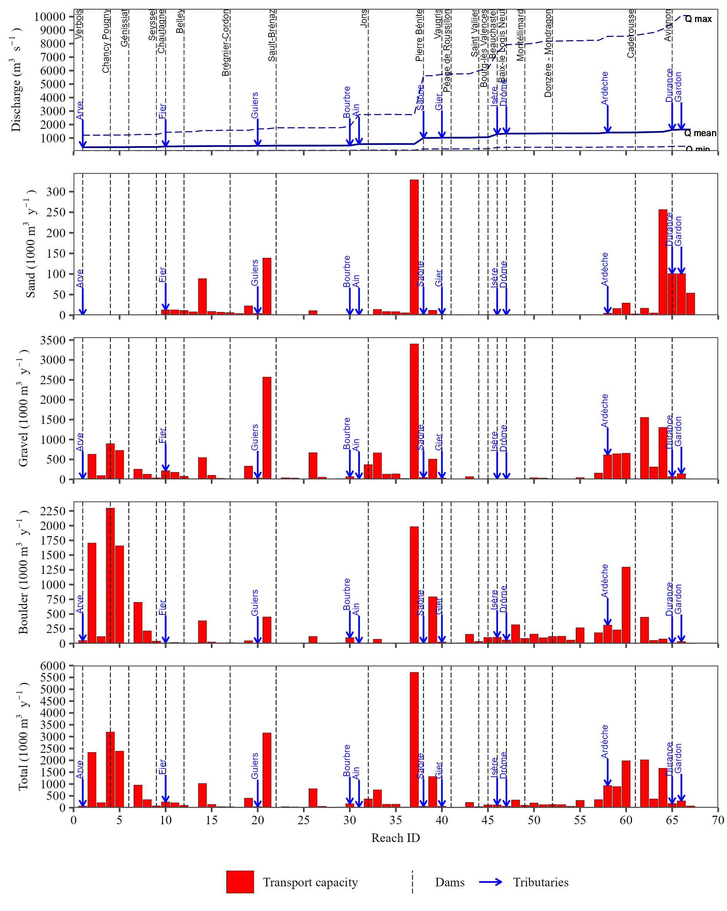

```


```{r TrE0eE, echo=FALSE, fig.cap='Cumulative discharge and bedload transported for sand (0.63-2 mm), gravel (2-256 mm), boulders (>256 mm), and the total of all three classes for each river reach along the Rhône River, calculated using the Eugelund and Hansen equation without accounting dams trap efficiency.'}

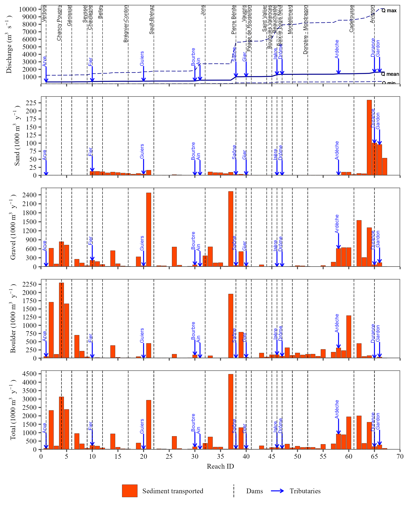

```


```{r DepE0eE, echo=FALSE, fig.cap='Cumulative discharge and bedload deposited for sand (0.63-2 mm), gravel (2-256 mm), boulders (>256 mm), and the total of all three classes for each river reach along the Rhône River, calculated using the Eugelund and Hansen equation without accounting dams trap efficiency.'}

knitr::include_graphics("img/res_cascade/res_E0_eE&H_noDams/plots_dep-silt/dep_res_sum_hy_E0_eE&H_noDams.png")

```


```{r budgetE0eE, echo=FALSE, fig.cap='Cumulative discharge and sediment budget for sand (0.63-2 mm), gravel (2-256 mm), boulders (>256 mm), and the total of all three classes for each river reach along the Rhône River, calculated using the Eugelund and Hansen equation without accounting dams trap efficiency.'}

knitr::include_graphics("img/res_cascade/res_E0_eE&H_noDams/plots_sed_budget-silt/sed_bud_res_sum_hy_E0_eE&H_noDams.png")

```


### Ackers and White equation

```{r TrcE0eA, echo=FALSE, fig.cap='Cumulative discharge and bedload transport capacity for sand (0.63-2 mm), gravel (2-256 mm), boulders (>256 mm), and the total of all three classes for each river reach along the Rhône River, calculated using the Ackers and White equation without accounting dams trap efficiency.'}

knitr::include_graphics("img/res_cascade/res_E0_eA&W_noDams/plots_tr_cap-silt/tr_cap_res_sum_hy_E0_eA&W_noDams.png")

```


```{r TrE0eA, echo=FALSE, fig.cap='Cumulative discharge and bedload transported for sand (0.63-2 mm), gravel (2-256 mm), boulders (>256 mm), and the total of all three classes for each river reach along the Rhône River, calculated using the Ackers and White equation without accounting dams trap efficiency.'}

knitr::include_graphics("img/res_cascade/res_E0_eA&W_noDams/plots_transp-silt/transp_res_sum_hy_E0_eA&W_noDams.png")

```


```{r DepE0eA, echo=FALSE, fig.cap='Cumulative discharge and bedload deposited for sand (0.63-2 mm), gravel (2-256 mm), boulders (>256 mm), and the total of all three classes for each river reach along the Rhône River, calculated using the Ackers and White equation without accounting dams trap efficiency.'}

knitr::include_graphics("img/res_cascade/res_E0_eA&W_noDams/plots_dep-silt/dep_res_sum_hy_E0_eA&W_noDams.png")

```


```{r budgetE0eA, echo=FALSE, fig.cap='Cumulative discharge and sediment budget for sand (0.63-2 mm), gravel (2-256 mm), boulders (>256 mm), and the total of all three classes for each river reach along the Rhône River, calculated using the Ackers and White equation without accounting dams trap efficiency.'}

knitr::include_graphics("img/res_cascade/res_E0_eA&W_noDams/plots_sed_budget-silt/sed_bud_res_sum_hy_E0_eA&W_noDams.png")

```


## 100% Trap efficiency

### Wilkock and Crowe equation

```{r TrcE3eW, echo=FALSE, fig.cap='Cumulative discharge and bedload transport capacity for sand (0.63-2 mm), gravel (2-256 mm), boulders (>256 mm), and the total of all three classes for each river reach along the Rhône River, calculated using the Wilkock and Crowe equation accounting dams trap efficiency of 100%.'}

knitr::include_graphics("img/res_cascade/res_E3_eW&C/plots_tr_cap-silt/tr_cap_res_sum_hy_E3_eW&C.png")

```


```{r TrE3eW, echo=FALSE, fig.cap='Cumulative discharge and bedload transported for sand (0.63-2 mm), gravel (2-256 mm), boulders (>256 mm), and the total of all three classes for each river reach along the Rhône River, calculated using the Wilkock and Crowe equation accounting dams trap efficiency of 100%.'}

knitr::include_graphics("img/res_cascade/res_E3_eW&C/plots_transp-silt/transp_res_sum_hy_E3_eW&C.png")

```


```{r DepE3eW, echo=FALSE, fig.cap='Cumulative discharge and bedload deposited for sand (0.63-2 mm), gravel (2-256 mm), boulders (>256 mm), and the total of all three classes for each river reach along the Rhône River, calculated using the Wilkock and Crowe equation accounting dams trap efficiency of 100%.'}

knitr::include_graphics("img/res_cascade/res_E3_eW&C/plots_dep-silt/dep_res_sum_hy_E3_eW&C.png")

```


```{r budgetE3eW, echo=FALSE, fig.cap='Cumulative discharge and sediment budget for sand (0.63-2 mm), gravel (2-256 mm), boulders (>256 mm), and the total of all three classes for each river reach along the Rhône River, calculated using the Wilkock and Crowe equation accounting dams trap efficiency of 100%.'}

knitr::include_graphics("img/res_cascade/res_E3_eW&C/plots_sed_budget-silt/sed_bud_res_sum_hy_E3_eW&C.png")

```


### Eugelund and Hansen equation

```{r TrcE3eE, echo=FALSE, fig.cap='Cumulative discharge and bedload transport capacity for sand (0.63-2 mm), gravel (2-256 mm), boulders (>256 mm), and the total of all three classes for each river reach along the Rhône River, calculated using the Eugelund and Hansen equation accounting dams trap efficiency of 100%.'}

knitr::include_graphics("img/res_cascade/res_E3_eE&H/plots_tr_cap-silt/tr_cap_res_sum_hy_E3_eE&H.png")

```


```{r TrE3eE, echo=FALSE, fig.cap='Cumulative discharge and bedload transported for sand (0.63-2 mm), gravel (2-256 mm), boulders (>256 mm), and the total of all three classes for each river reach along the Rhône River, calculated using the Eugelund and Hansen equation accounting dams trap efficiency of 100%.'}

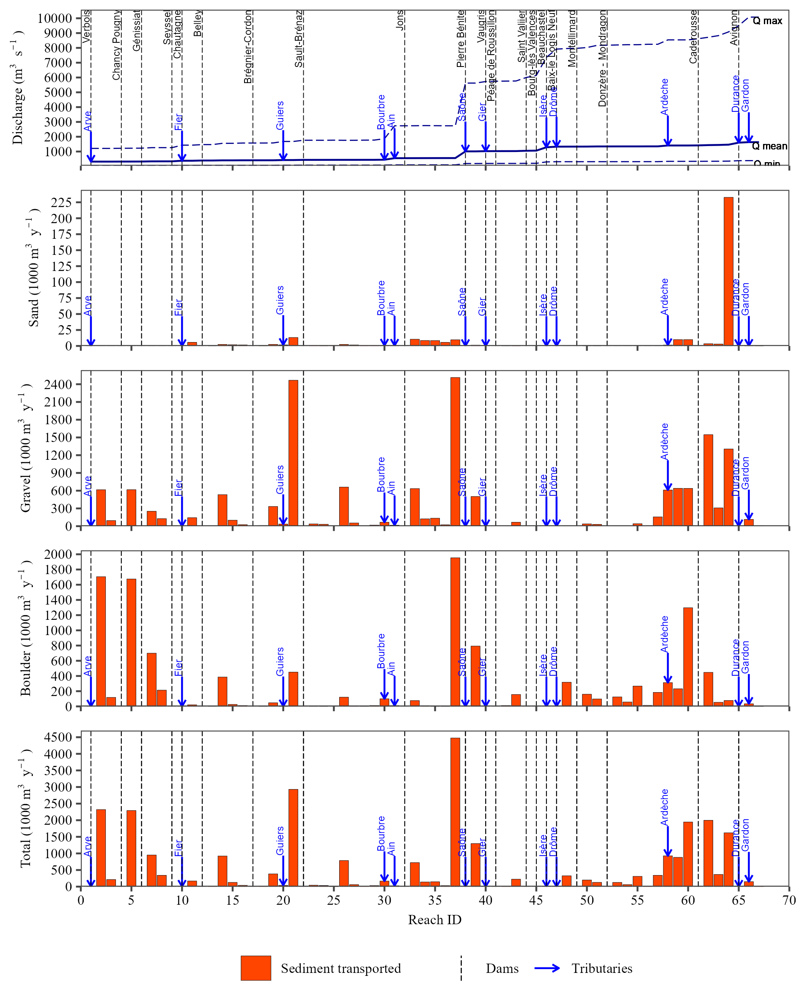

```


```{r DepE3eE, echo=FALSE, fig.cap='Cumulative discharge and bedload deposited for sand (0.63-2 mm), gravel (2-256 mm), boulders (>256 mm), and the total of all three classes for each river reach along the Rhône River, calculated using the Eugelund and Hansen equation accounting dams trap efficiency of 100%.'}

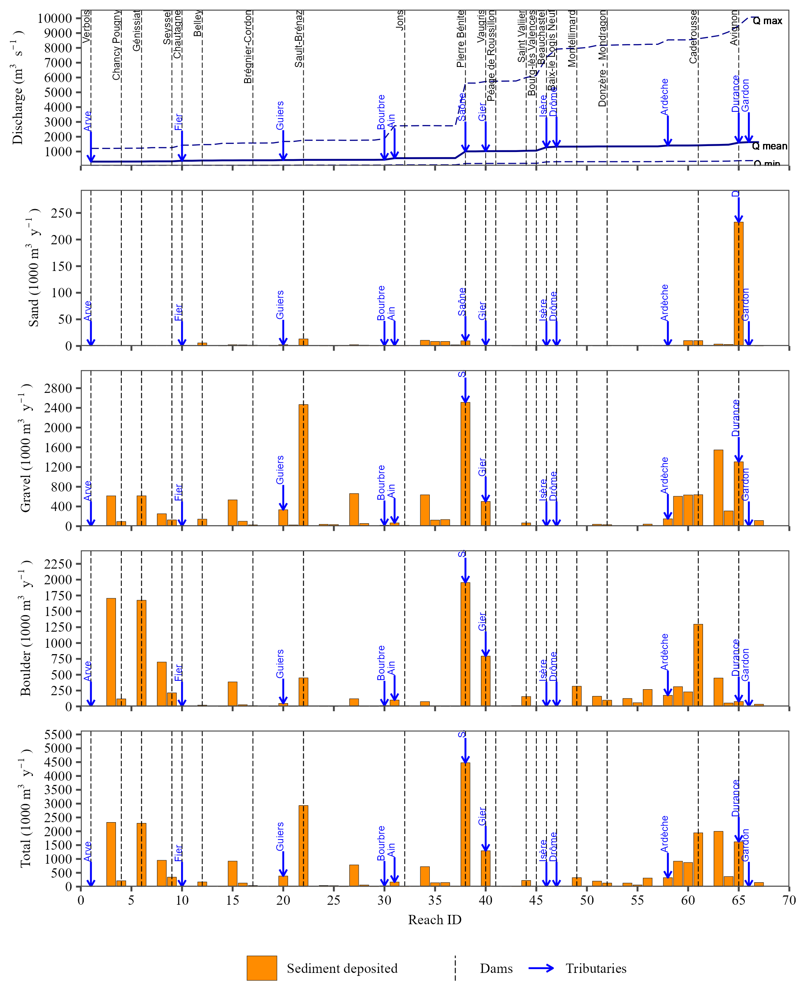

```


```{r budgetE3eE, echo=FALSE, fig.cap='Cumulative discharge and sediment budget for sand (0.63-2 mm), gravel (2-256 mm), boulders (>256 mm), and the total of all three classes for each river reach along the Rhône River, calculated using the Eugelund and Hansen equation accounting dams trap efficiency of 100%.'}

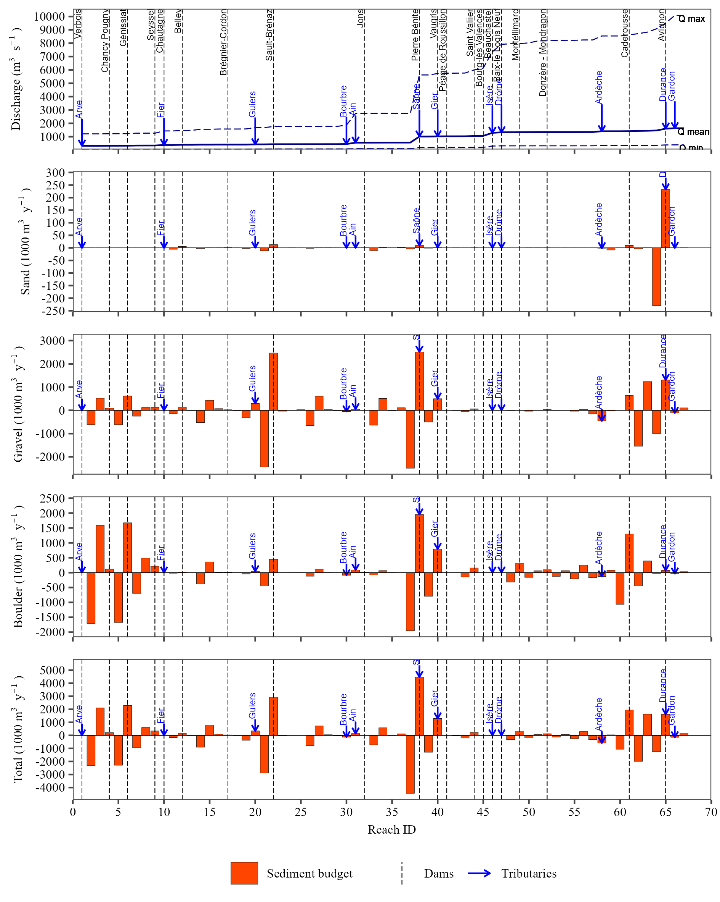

```


### Ackers and White equation

```{r TrcE3eA, echo=FALSE, fig.cap='Cumulative discharge and bedload transport capacity for sand (0.63-2 mm), gravel (2-256 mm), boulders (>256 mm), and the total of all three classes for each river reach along the Rhône River, calculated using the Ackers and White equation accounting dams trap efficiency of 100%.'}

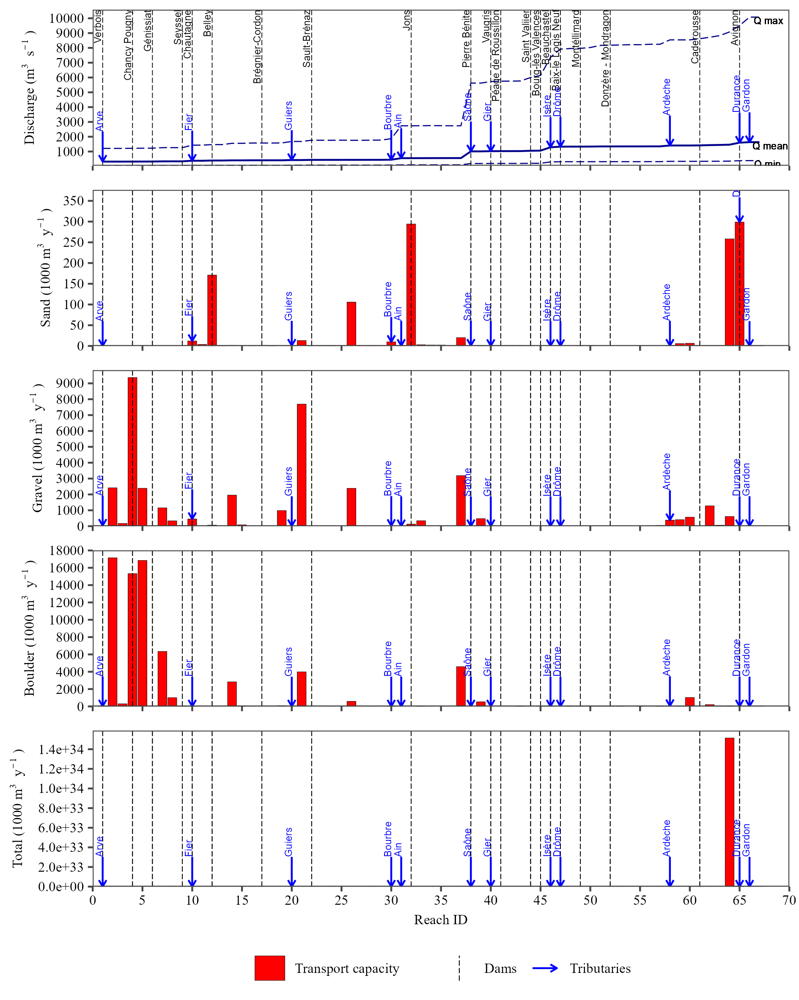

```


```{r TrE3eA, echo=FALSE, fig.cap='Cumulative discharge and bedload transported for sand (0.63-2 mm), gravel (2-256 mm), boulders (>256 mm), and the total of all three classes for each river reach along the Rhône River, calculated using the Ackers and White equation accounting dams trap efficiency of 100%.'}

knitr::include_graphics("img/res_cascade/res_E3_eA&W/plots_transp-silt/transp_res_sum_hy_E3_eA&W.png")

```


```{r DepE3eA, echo=FALSE, fig.cap='Cumulative discharge and bedload deposited for sand (0.63-2 mm), gravel (2-256 mm), boulders (>256 mm), and the total of all three classes for each river reach along the Rhône River, calculated using the Ackers and White equation accounting dams trap efficiency of 100%.'}

knitr::include_graphics("img/res_cascade/res_E3_eA&W/plots_dep-silt/dep_res_sum_hy_E3_eA&W.png")

```


```{r budgetE3eA, echo=FALSE, fig.cap='Cumulative discharge and sediment budget for sand (0.63-2 mm), gravel (2-256 mm), boulders (>256 mm), and the total of all three classes for each river reach along the Rhône River, calculated using the Ackers and White equation accounting dams trap efficiency of 100%.'}

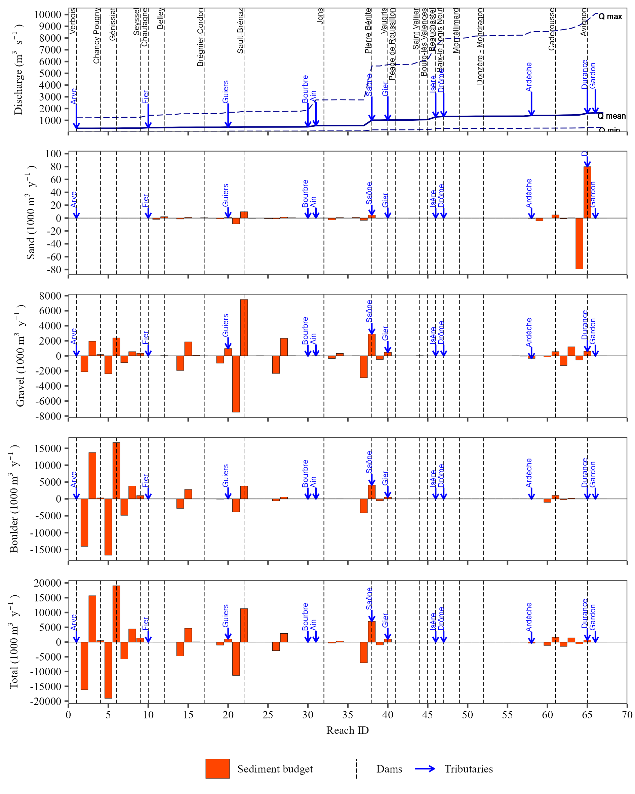

```


## Trap efficiency (Table 1)

### Wilkock and Crowe equation

```{r TrcE2eW, echo=FALSE, fig.cap='Cumulative discharge and bedload transport capacity for sand (0.63-2 mm), gravel (2-256 mm), boulders (>256 mm), and the total of all three classes for each river reach along the Rhône River, calculated using the Wilkock and Crowe equation accounting dams trap efficiency of Table 1.'}

knitr::include_graphics("img/res_cascade/res_E2_eW&C/plots_tr_cap-silt/tr_cap_res_sum_hy_E2_eW&C.png")

```


```{r TrE2eW, echo=FALSE, fig.cap='Cumulative discharge and bedload transported for sand (0.63-2 mm), gravel (2-256 mm), boulders (>256 mm), and the total of all three classes for each river reach along the Rhône River, calculated using the Wilkock and Crowe equation accounting dams trap efficiency of Table 1.'}

knitr::include_graphics("img/res_cascade/res_E2_eW&C/plots_transp-silt/transp_res_sum_hy_E2_eW&C.png")

```


```{r DepE2eW, echo=FALSE, fig.cap='Cumulative discharge and bedload deposited for sand (0.63-2 mm), gravel (2-256 mm), boulders (>256 mm), and the total of all three classes for each river reach along the Rhône River, calculated using the Wilkock and Crowe equation accounting dams trap efficiency of Table 1.'}

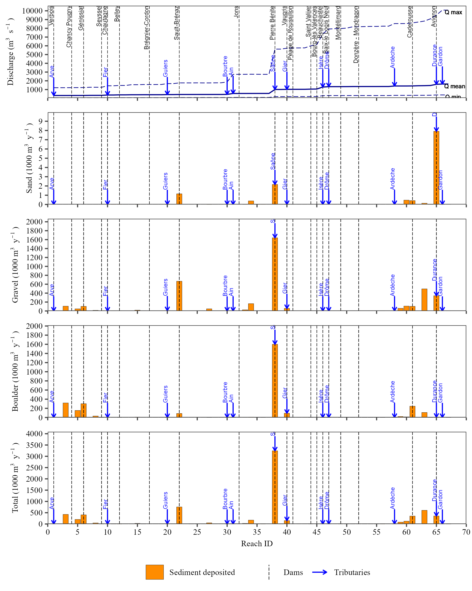

```


```{r budgetE2eW, echo=FALSE, fig.cap='Cumulative discharge and sediment budget for sand (0.63-2 mm), gravel (2-256 mm), boulders (>256 mm), and the total of all three classes for each river reach along the Rhône River, calculated using the Wilkock and Crowe equation accounting dams trap efficiency of Table 1.'}

knitr::include_graphics("img/res_cascade/res_E2_eW&C/plots_sed_budget-silt/sed_bud_res_sum_hy_E2_eW&C.png")

```


### Eugelund and Hansen equation

```{r TrcE2eE, echo=FALSE, fig.cap='Cumulative discharge and bedload transport capacity for sand (0.63-2 mm), gravel (2-256 mm), boulders (>256 mm), and the total of all three classes for each river reach along the Rhône River, calculated using the Eugelund and Hansen equation accounting dams trap efficiency of Table 1.'}

knitr::include_graphics("img/res_cascade/res_E2_eE&H/plots_tr_cap-silt/tr_cap_res_sum_hy_E2_eE&H.png")

```


```{r TrE2eE, echo=FALSE, fig.cap='Cumulative discharge and bedload transported for sand (0.63-2 mm), gravel (2-256 mm), boulders (>256 mm), and the total of all three classes for each river reach along the Rhône River, calculated using the Eugelund and Hansen equation accounting dams trap efficiency of Table 1.'}

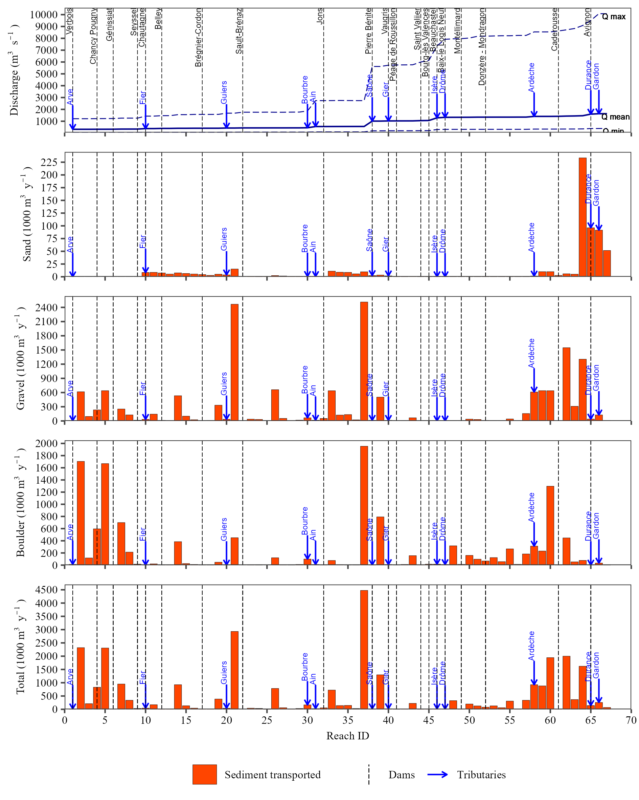

```


```{r DepE2eE, echo=FALSE, fig.cap='Cumulative discharge and bedload deposited for sand (0.63-2 mm), gravel (2-256 mm), boulders (>256 mm), and the total of all three classes for each river reach along the Rhône River, calculated using the Eugelund and Hansen equation accounting dams trap efficiency of Table 1.'}

knitr::include_graphics("img/res_cascade/res_E2_eE&H/plots_dep-silt/dep_res_sum_hy_E2_eE&H.png")

```


```{r budgetE2eE, echo=FALSE, fig.cap='Cumulative discharge and sediment budget for sand (0.63-2 mm), gravel (2-256 mm), boulders (>256 mm), and the total of all three classes for each river reach along the Rhône River, calculated using the Eugelund and Hansen equation accounting dams trap efficiency of Table 1.'}

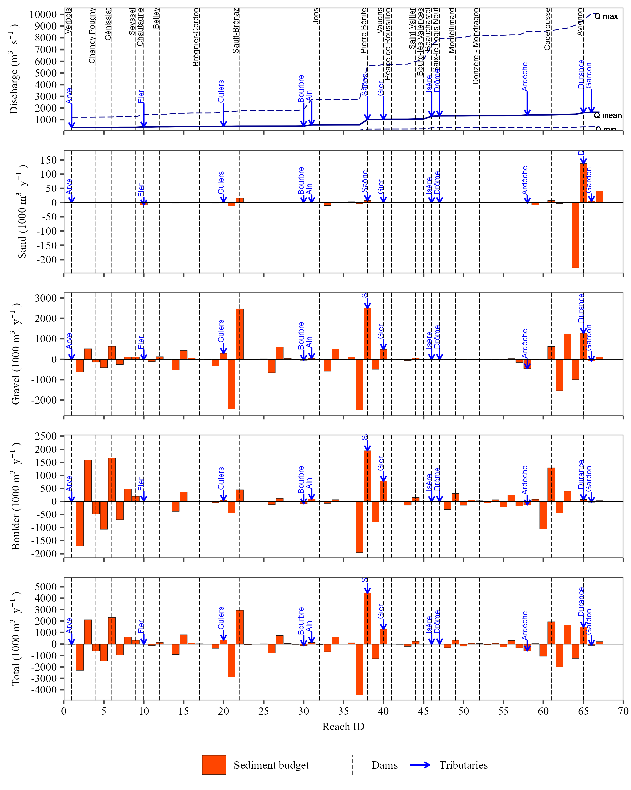

```


### Ackers and White equation

```{r TrcE2eA, echo=FALSE, fig.cap='Cumulative discharge and bedload transport capacity for sand (0.63-2 mm), gravel (2-256 mm), boulders (>256 mm), and the total of all three classes for each river reach along the Rhône River, calculated using the Ackers and White equation without accounting dams trap efficiency.'}


```


```{r TrE2eA, echo=FALSE, fig.cap='Cumulative discharge and bedload transported for sand (0.63-2 mm), gravel (2-256 mm), boulders (>256 mm), and the total of all three classes for each river reach along the Rhône River, calculated using the Ackers and White equation without accounting dams trap efficiency.'}


```


```{r DepE2eA, echo=FALSE, fig.cap='Cumulative discharge and bedload deposited for sand (0.63-2 mm), gravel (2-256 mm), boulders (>256 mm), and the total of all three classes for each river reach along the Rhône River, calculated using the Ackers and White equation without accounting dams trap efficiency.'}

knitr::include_graphics("img/res_cascade/res_E2_eA&W/plots_dep-silt/dep_res_sum_hy_E2_eA&W.png")

```


```{r budgetE2eA, echo=FALSE, fig.cap='Cumulative discharge and sediment budget for sand (0.63-2 mm), gravel (2-256 mm), boulders (>256 mm), and the total of all three classes for each river reach along the Rhône River, calculated using the Ackers and White equation without accounting dams trap efficiency.'}

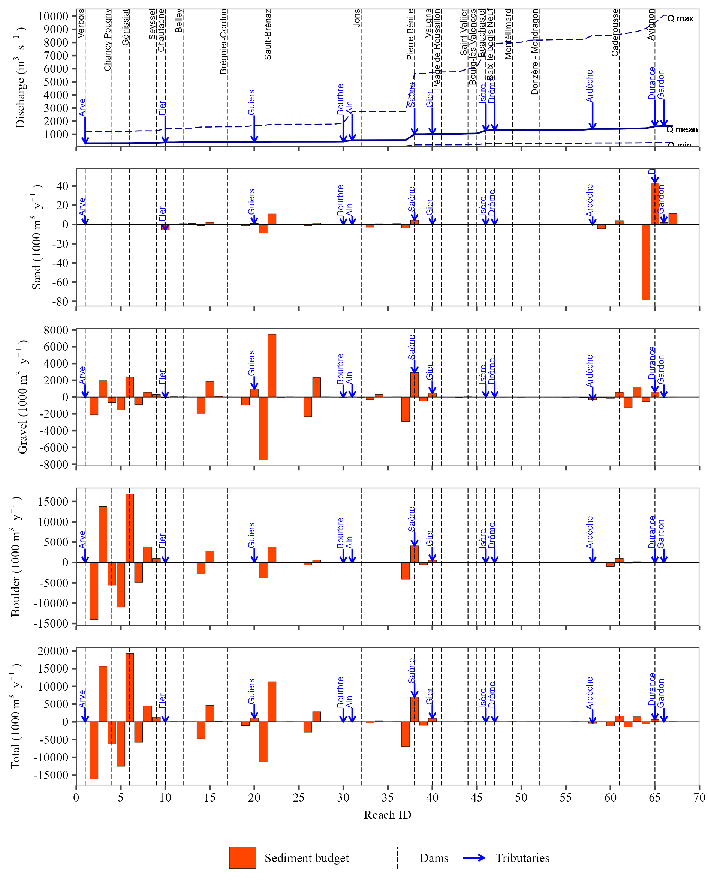

```


## Bedload transport capacity

The results of transport capacity using the three equations along the Rhône River are shown in Figure \@ref(fig:Trcmap). The scale was adjusted to be consistent with the report by Laval [-@Laval20] (Figure \@ref(fig:Laval20)).


```{r Trcmap, echo=FALSE, fig.cap='Bedload transport capacity along the Rhône River calculated using three different equations: Wilcock and Crowe, Engelund and Hansen, and Ackers and White.'}

knitr::include_graphics("img/res_cascade_trc.png")

```

```{r Laval20, echo=FALSE, fig.cap='Bedload transport capacity actual according Laval [-@Laval20].', out.width="60%"}

knitr::include_graphics("img/laval_2020.png")

```

Analyzing the bedload transport capacity described in the report by Laval [-@Laval20], the equation that produced the most consistent pattern in the CASCADE model was that of Engelund and Hansen [-@EandH67]. The Ackers and White equation [-@AandW73] also showed a reasonable pattern; however, when comparing the results (Figure \@ref(fig:TrcE2eA)), the transport capacity simulated by the CASCADE model was significantly higher.

Similarly, although the Engelund and Hansen equation [-@EandH67] tended to overestimate transport capacity, its results were more consistent with the reference than those from the other equations.

Figure \@ref(fig:EHxLaval20) shows a comparison between the results from Laval [-@Laval20] and those obtained using the Engelund and Hansen [-@EandH67] equation, presented in quantiles.


```{r EHxLaval20, echo=FALSE, fig.cap='Bedload transport capacity actual according Laval [-@Laval20] and Engelund and Hansen [-@EandH67].'}

knitr::include_graphics("img/res_cascade_trcxlaval.png")

```


# References


